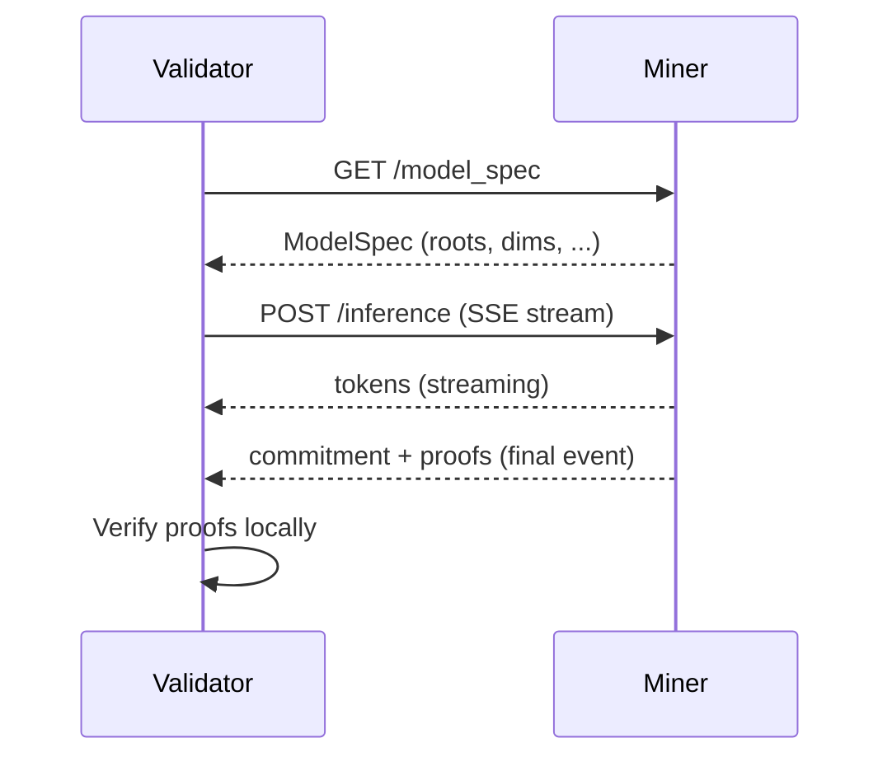

# API Reference

Verathos exposes two API layers: the **gateway** (user-facing, OpenAI-compatible) and the **miner server** (validator-facing, proof protocol). Most users only interact with the gateway.

## Gateway API (User-Facing)

The gateway is the OpenAI-compatible API endpoint. Drop-in replacement for any OpenAI SDK.

### Inference

#### `POST /v1/chat/completions`

Standard OpenAI chat completions. Supports streaming.

```bash
curl -X POST https://api.verathos.ai/v1/chat/completions \
  -H "Authorization: Bearer vrt_sk_..." \
  -H "Content-Type: application/json" \
  -d '{
    "model": "qwen3-8b",
    "messages": [{"role": "user", "content": "Hello!"}],
    "stream": true,
    "max_tokens": 500
  }'
```

**Request fields:**

- `messages`: array of `{role, content}` objects (required)
- `model`: model ID or `"auto"` (required). Use `"auto"` to let Verathos pick the best available model based on miner scores. Retries automatically fall through to the next-best endpoint across all models.
- `max_tokens`: max output tokens
- `stream`: enable SSE streaming (default: false)
- `temperature`: sampling temperature (default: 1.0)
- `do_sample`: enable stochastic sampling (default: false). When true, the inference proof additionally binds the chosen tokens to a committed seed via canonical sampler replay (see [Inference Protocol: Stochastic sampling correctness](inference_protocol.md#what-gets-verified))
- `enable_thinking`: chain-of-thought for thinking models like Qwen3 (default: true)
- `top_k`, `top_p`, `min_p`: sampling parameters. These are bound into the proof commitment via `sampler_config_hash`; the gateway verifies the miner used the requested values
- `presence_penalty`: penalty for repeated tokens
- `include_proof`: include proof bundle in response (default: true). Set false to save ~50-100 KB bandwidth per request. Verification still happens server-side.

**Response** (non-streaming):
```json
{
  "id": "chatcmpl-...",
  "object": "chat.completion",
  "created": 1710000000,
  "model": "qwen3-8b",
  "choices": [{
    "index": 0,
    "message": {"role": "assistant", "content": "Hello! ..."},
    "finish_reason": "stop"
  }],
  "usage": {"prompt_tokens": 12, "completion_tokens": 45, "total_tokens": 57},
  "proof_verified": true,
  "timing": {"inference_ms": 1350, "verify_ms": 4.2}
}
```

Every response includes `proof_verified` and `timing` fields with verification details.

### Models & Pricing

#### `GET /v1/models`

List available models with live USD pricing and current availability.

```bash
curl https://api.verathos.ai/v1/models \
  -H "Authorization: Bearer vrt_sk_..."
```

#### `GET /v1/price`

Compute cost for a hypothetical request before sending.

```bash
curl "https://api.verathos.ai/v1/price?model=qwen3-8b&input_tokens=100&output_tokens=500"
```

Query parameters: `model`, `input_tokens`, `output_tokens`, `verified` (default: false; set true for the 25% verification surcharge).

**Response:**
```json
{
  "model": "qwen3-8b",
  "input_tokens": 100,
  "output_tokens": 500,
  "verified": false,
  "verified_multiplier": 1.0,
  "cost_usd": 0.000078,
  "cost_tao": 0.00000025,
  "tao_usd": 308.0,
  "input_usd_per_1m": 0.08,
  "output_usd_per_1m": 0.14
}
```

`cost_tao` and `tao_usd` are included when the TAO price feed is active.

### Balance & Credits

#### `GET /v1/balance`

Check credit balance (TAO + USD).

```bash
curl https://api.verathos.ai/v1/balance \
  -H "Authorization: Bearer vrt_sk_..."
```

**Response:**
```json
{
  "balance_tao": 0.1,
  "total_deposited_tao": 0.15,
  "total_consumed_tao": 0.05,
  "total_withdrawn_tao": 0.0,
  "balance_usd": 10.0,
  "total_deposited_usd": 10.0,
  "total_consumed_usd": 0.0,
  "total_withdrawn_usd": 0.0,
  "tao_usd": 500.0,
  "total_balance_usd": 60.0
}
```

`tao_usd` and `total_balance_usd` are included when the price feed is active.

#### `GET /v1/usage`

Usage history (most recent first).

```bash
curl "https://api.verathos.ai/v1/usage?limit=50" \
  -H "Authorization: Bearer vrt_sk_..."
```

**Response:**
```json
{
  "usage": [
    {
      "request_id": "...",
      "model_id": "qwen3-8b",
      "input_tokens": 100,
      "output_tokens": 250,
      "tao_cost": 0.000012,
      "timestamp": 1710000000
    }
  ]
}
```

### Deposits & Withdrawals

#### `GET /v1/user/deposit-address`

Get per-user deposit addresses (TAO on Bittensor + USDC on Base).

```bash
curl https://api.verathos.ai/v1/user/deposit-address \
  -H "Authorization: Bearer vrt_sk_..."
```

**Response:**
```json
{
  "tao": {
    "address": "5G6xBZHQ...",
    "evm_address": "0x...",
    "network": "bittensor-mainnet"
  },
  "min_deposit_tao": 0.01,
  "instructions": "Send TAO to tao.address, or USDC/ETH to base.address. Credits appear within 30 seconds.",
  "base": {
    "address": "0x...",
    "network": "base-mainnet",
    "usdc_contract": "0x..."
  }
}
```

The `base` field is only present when Base deposits are enabled by the validator. Send TAO to `tao.address` (SS58), or USDC to `base.address` on Base.

#### `POST /v1/user/withdraw`

Withdraw unconsumed TAO or USDC. Rate limited to 1 per 5 minutes.

```bash
# TAO withdrawal (to Bittensor EVM address)
curl -X POST https://api.verathos.ai/v1/user/withdraw \
  -H "Authorization: Bearer vrt_sk_..." \
  -H "Content-Type: application/json" \
  -d '{"amount_tao": 0.05, "destination": "0xYourEVMAddress"}'

# USDC withdrawal (to Base address)
curl -X POST https://api.verathos.ai/v1/user/withdraw \
  -H "Authorization: Bearer vrt_sk_..." \
  -H "Content-Type: application/json" \
  -d '{"amount_usdc": 5.0, "destination": "0xYourBaseAddress"}'
```

Specify either `amount_tao` or `amount_usdc`, not both. Minimum: 0.01 TAO or $1.00 USDC.

#### `POST /v1/deposits/base/verify`

Verify a USDC deposit on Base by transaction hash. Credits the user's account after on-chain confirmation.

```bash
curl -X POST https://api.verathos.ai/v1/deposits/base/verify \
  -H "Authorization: Bearer vrt_sk_..." \
  -H "Content-Type: application/json" \
  -d '{"tx_hash": "0x..."}'
```

#### `GET /v1/deposits/base`

List your Base USDC deposits. Query parameter: `limit` (default 50, max 200).

```bash
curl "https://api.verathos.ai/v1/deposits/base?limit=10" \
  -H "Authorization: Bearer vrt_sk_..."
```

#### `GET /v1/deposit-info`

Public (no auth). Returns deposit configuration: contract addresses, validator hotkey, owner cut.

### Authentication

| Endpoint | Method | Description |
|----------|--------|-------------|
| `/v1/auth/register` | POST | Register with email/password, returns first API key |
| `/v1/auth/login` | POST | Validate email/password credentials (no key created) |
| `/v1/auth/keys` | POST | Validate email/password + create a new API key |
| `/v1/auth/challenge` | GET | Get challenge string for wallet signature auth |
| `/v1/auth/wallet` | POST | Authenticate with EIP-191 wallet signature, returns API key |
| `/v1/api-keys` | GET | List your API keys |
| `/v1/api-keys/{hash}` | DELETE | Revoke an API key |

See the [User Guide](user_guide.md) for step-by-step authentication walkthrough.

**Authentication header:**
```
Authorization: Bearer vrt_sk_...
```

### TEE Encrypted Inference

> **Not yet available on mainnet.** TEE is currently available on testnet (Subnet 405) and will be enabled on mainnet once reproducible builds are validated across hardware platforms.

#### `GET /tee/info`

Public (no auth). Returns the enclave public key and attestation for a TEE-enabled miner.

```bash
curl "https://api.verathos.ai/tee/info?model=qwen3-8b"
```

Query parameter: `model` (default `"auto"`, which picks the best available TEE miner).

**Response:**
```json
{
  "enclave_public_key": "13cc71a8...",
  "attestation": { "platform": "tdx", "attestation_report": "...", ... },
  "model": "Qwen/Qwen3-8B",
  "model_weight_hash": "e733ab1a...",
  "miner_address": "0x...",
  "model_id": "Qwen/Qwen3-8B"
}
```

#### `POST /v1/tee/chat/completions`

E2E encrypted inference (non-streaming). The request body is an encrypted envelope; the gateway cannot read the plaintext.

**Request fields:**
- `session_id`: UUID
- `sender_public_key`: hex-encoded 32-byte X25519 ephemeral public key
- `nonce`: hex-encoded 24-byte XSalsa20 nonce
- `ciphertext`: hex-encoded encrypted payload
- `model`: model ID for routing + billing (plaintext, not encrypted)
- `target_enclave_key`: hex-encoded enclave public key (pins request to specific miner)

Use the `TEEClient` Python library to handle encryption automatically. See [User Guide: TEE Inference](user_guide.md#tee-inference-trusted-execution-environments).

#### `POST /v1/tee/chat/completions/stream`

Same as above but returns SSE events with encrypted token chunks. Event types: `encrypted_token`, `done`, `error`.

### x402 Pay-Per-Request

No API key or deposit needed. Pay per request with USDC on Base:

1. Send request without auth; gateway returns HTTP 402 with payment requirements
2. Sign a USDC payment using x402 client SDK
3. Resend with `PAYMENT-SIGNATURE` or `X-PAYMENT` header
4. Inference proceeds, response returned

**Note:** x402 uses the `exact` scheme, charging based on `max_tokens` (worst case), not actual output. Set `max_tokens` conservatively. For fair per-token pricing, use the API key + deposit flow.

### Rate Limits

All endpoints are rate-limited. Responses include `X-RateLimit-Limit` and `X-RateLimit-Remaining` headers. Exceeding limits returns HTTP 429 with a `Retry-After` header.

| Tier | Endpoints | Key | Limit |
|------|-----------|-----|-------|
| Inference | `POST /v1/chat/completions`, TEE variants | per-API-key | 300/min |
| Auth | register, login, wallet | per-IP | 10/min |
| Authenticated reads | balance, usage, keys, deposits | per-API-key | 60/min |
| Public reads | `/v1/models`, `/v1/price`, `/health` | per-IP | 60/min |
| Withdrawal | `POST /v1/user/withdraw` | per-API-key | 1/5min |

### Other

#### `GET /health`

Liveness check (no auth required). Returns `{"status": "ok"}`. Detailed info (models, miner health, epoch) requires admin authentication.

#### `GET /v1/network/stats`

Public. Network-wide statistics: miner pool state, organic traffic stats, probation info.

---

## Miner Server API

The miner server is what miners run. Validators interact with it directly during canary testing. Most users don't need this; the gateway handles routing and verification.

### Protocol

The verification protocol is **non-interactive** (Fiat-Shamir): a single `POST /inference` streams tokens and returns commitment + proofs. No separate proof request needed.



**Total: 2 HTTP requests.** True non-interactive protocol.

### `GET /health`

Server status, loaded model, batch mode info, KV cache utilization.

```json
{
    "status": "ok",
    "model": "Qwen/Qwen3-8B",
    "moe": false,
    "batch_mode": true,
    "capture_backend": "splitting_ops",
    "max_model_len": 32768,
    "active_requests": 3,
    "max_requests": 32,
    "kv_pool_tokens": 131072,
    "kv_used_tokens": 45000,
    "kv_free_tokens": 86072,
    "kv_utilization_pct": 34.3,
    "proof_pending": 1,
    "proof_max_pending": 16
}
```

### `GET /model_spec`

Returns the ModelSpec with per-layer weight Merkle roots.

**Response fields:**

- `model_id`: HuggingFace model name
- `weight_merkle_root`: 32-byte overall model commitment (hex)
- `model_commitment`: overall model commitment (hex)
- `num_layers`, `hidden_dim`, `vocab_size`
- `num_experts`: number of experts (0 for dense models)
- `expert_weight_merkle_roots`: per-expert roots indexed by layer (MoE only)
- `quantization`: quantization mode
- `router_top_k`, `router_scoring`: MoE routing parameters
- `timestamp`: when the spec was computed

In production, validators read ModelSpec from the on-chain ModelRegistry, not from this endpoint.

### `POST /inference`

Full inference + proof generation, streamed via SSE.

**Request:**
```json
{
    "prompt": "Explain what a Merkle tree is.",
    "validator_nonce": "a1b2c3...64hex",
    "max_new_tokens": 50,
    "do_sample": false,
    "temperature": 1.0,
    "enable_thinking": true
}
```

**SSE events:**

1. `event: token` - one per generated token: `{"text": "A "}`
2. `event: done` - final event with commitment, proof bundle, and timing breakdown (`inference_ms`, `ttft_ms`, `prove_ms`, etc.)
3. `event: error` - on failure (includes `retry_after_ms` if server is busy)

### `POST /chat`

OpenAI-style chat (messages array). Same SSE stream format as `/inference`. Chat template is applied server-side.

### TEE Endpoints (Miner)

> **Not yet available on mainnet.** Available on testnet (Subnet 405).

| Endpoint | Method | Description |
|----------|--------|-------------|
| `/tee/info` | GET | Enclave public key, attestation report, model identity |
| `/tee/chat` | POST | Encrypted inference (SSE stream with encrypted token chunks) |
| `/tee/reattest` | POST | Re-attestation with validator nonce (liveness proof) |

### `POST /identity/challenge`

Anti-hijacking endpoint. Proves the server controls the registered EVM address by signing a nonce.

### Epoch receipt endpoints

Support the epoch-based canary testing protocol:

| Endpoint | Method | Description |
|----------|--------|-------------|
| `/epoch/receipt` | POST | Store a validator-signed receipt (rate limited: 200/epoch) |
| `/epoch/{n}/receipts` | GET | Pull all receipts for epoch N |

Receipts include metrics (TTFT, tok/s, proof result) and are self-authenticating via Ed25519 signatures.

### Authentication

- **Public endpoints** (no auth): `/health`, `/model_spec`, `/identity/challenge`
- **Validator-authenticated**: All other endpoints require validator signature headers (`X-Validator-Hotkey`, `X-Validator-Signature`, `X-Validator-Timestamp`)
- **Optional API key**: Set `VERATHOS_API_KEY` env var or `--api-key` flag to protect miner endpoints. Clients include `Authorization: Bearer <key>` or `X-API-Key: <key>`.

---

## Performance

See the [Inference Protocol](inference_protocol.md) for detailed overhead measurements by model type. Summary:

- **Proof generation**: 20–600ms depending on model size
- **Verification**: 4–200ms (CPU-only, no GPU needed)
- **Total overhead**: ~1–8% of inference time depending on model size (see protocol docs for breakdown)
- **Data transfer**: ~200 bytes request, ~50-100 KB response (tokens + proofs)
