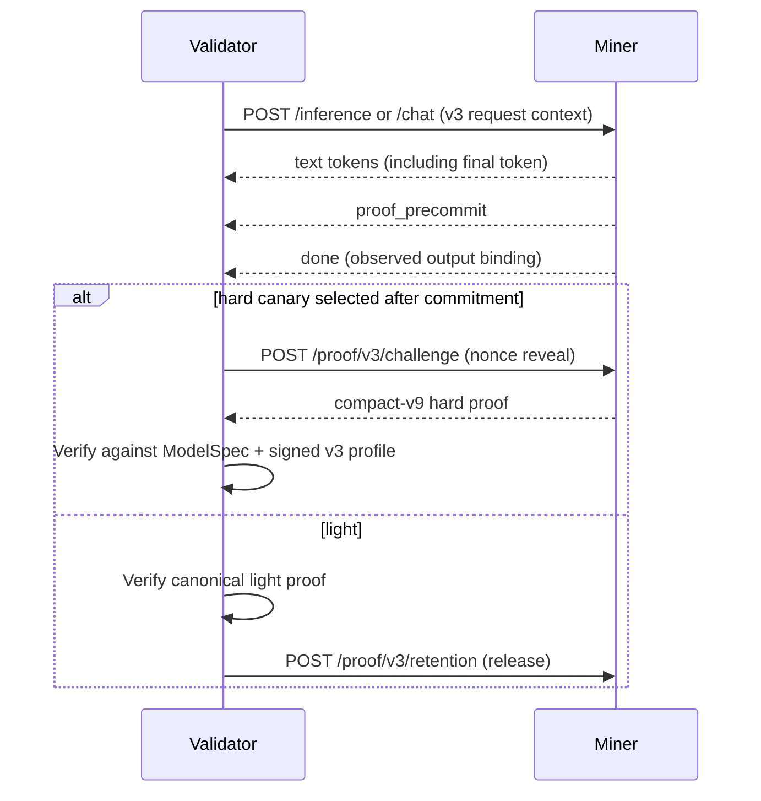

# API Reference

Verathos exposes two API layers: the **gateway** (user-facing, OpenAI-compatible) and the **miner server** (validator-facing, proof protocol). Most users only interact with the gateway.

## Gateway API (User-Facing)

The gateway is the OpenAI-compatible API endpoint. Drop-in replacement for any OpenAI SDK.

### Inference

#### `POST /v1/chat/completions`

Standard OpenAI chat completions. Supports streaming.

```bash
curl -X POST https://api.verathos.ai/v1/chat/completions \
  -H "Authorization: Bearer vrt_sk_..." \
  -H "Content-Type: application/json" \
  -d '{
    "model": "qwen3-8b",
    "messages": [{"role": "user", "content": "Hello!"}],
    "stream": true,
    "max_tokens": 500
  }'
```

**Request fields:**

- `messages`: array of `{role, content}` objects (required)
- `model`: model ID or `"auto"` (required). Use `"auto"` to let Verathos pick the best available model based on miner scores. Retries automatically fall through to the next-best endpoint across all models.
- `max_tokens`: max output tokens
- `stream`: enable SSE streaming (default: false)
- `temperature`: sampling temperature (default: 1.0)
- `do_sample`: enable stochastic sampling (default: false). The exact sampler configuration is bound into the v3 light proof. Hard execution audits currently use qualified sampler profiles.
- `enable_thinking`: chain-of-thought for thinking models like Qwen3 (default: true)
- `top_k`, `top_p`, `min_p`: sampling parameters. These are bound into the proof commitment via `sampler_config_hash`; the gateway verifies the miner used the requested values
- `presence_penalty`: penalty for repeated tokens
- `include_proof`: include available verification metadata in the response (default: true). Ordinary v3 traffic carries a light proof; hard-audit evidence is present only when that tier is selected.
- `tools`: optional OpenAI-compatible tool definitions. Each entry uses the standard `{"type":"function","function":{...}}` shape.
- `tool_choice`: optional tool policy. Supports `"auto"`, `"none"`, `"required"`, or a forced function object such as `{"type":"function","function":{"name":"web_search"}}`.
- `parallel_tool_calls`: optional boolean. Set `false` to request at most one tool call.

Tool calling is available only on model routes that advertise support. Check `GET /v1/models` and look for `supported_parameters` containing `tools`, `tool_choice`, and `parallel_tool_calls`. If no miner for the requested model supports these parameters, the gateway returns `503` instead of silently routing to an old miner.

The API follows the OpenAI tool-calling contract: the model decides whether to return `tool_calls`, but your client executes the tool and sends the result back as a `role: "tool"` message. The hosted Verathos webapp has its own SearXNG-backed `web_search` executor; raw API clients must run their own tool executors.

Tool-decision requests must use `stream: false`. After your client executes the tool, the final answer request may use `stream: true` or `stream: false`.

**Tool-calling example:**

```bash
curl -X POST https://api.verathos.ai/v1/chat/completions \
  -H "Authorization: Bearer vrt_sk_..." \
  -H "Content-Type: application/json" \
  -d '{
    "model": "qwen3.5-9b",
    "messages": [{"role": "user", "content": "Search the web for current Verathos docs"}],
    "tools": [{
      "type": "function",
      "function": {
        "name": "web_search",
        "description": "Search the web and return relevant source snippets.",
        "parameters": {
          "type": "object",
          "properties": {
            "query": {"type": "string"},
            "max_results": {"type": "integer", "minimum": 1, "maximum": 10}
          },
          "required": ["query"]
        }
      }
    }],
    "tool_choice": "auto",
    "parallel_tool_calls": false,
    "stream": false
  }'
```

A tool decision response has `finish_reason: "tool_calls"` and an assistant message with `tool_calls`. After executing the tool, append both the assistant tool-call message and a `role: "tool"` result message, then call `/v1/chat/completions` again with `tool_choice: "none"` or without tools for the final answer.

**Response** (non-streaming):
```json
{
  "id": "chatcmpl-...",
  "object": "chat.completion",
  "created": 1710000000,
  "model": "qwen3-8b",
  "choices": [{
    "index": 0,
    "message": {"role": "assistant", "content": "Hello! ..."},
    "finish_reason": "stop"
  }],
  "usage": {"prompt_tokens": 12, "completion_tokens": 45, "total_tokens": 57},
  "timing": {
    "inference_ms": 1350,
    "proof_protocol_version": 3,
    "proof_v3_hard_audit_selected": false
  }
}
```

Successful v3 organic responses include timing and protocol metadata. A
`proof_verified` boolean is present only when the gateway actually verified a
hard or legacy proof. The hosted chat renders a successful ordinary v3
exchange as **Light proof accepted**.

### Models & Pricing

#### `GET /v1/models`

List available models with live USD pricing and current availability.

```bash
curl https://api.verathos.ai/v1/models \
  -H "Authorization: Bearer vrt_sk_..."
```

Model entries include `supported_parameters`, which tells OpenAI-compatible clients which optional request fields are currently routeable for that model. Tool-capable routes advertise:

```json
{
  "id": "qwen3.5-9b",
  "supported_parameters": ["tools", "tool_choice", "parallel_tool_calls"]
}
```

#### `GET /v1/price`

Compute cost for a hypothetical request before sending.

```bash
curl "https://api.verathos.ai/v1/price?model=qwen3-8b&input_tokens=100&output_tokens=500"
```

Query parameters: `model`, `input_tokens`, `output_tokens`, `verified` (default: false; set true for the 25% verification surcharge).

**Response:**
```json
{
  "model": "qwen3-8b",
  "input_tokens": 100,
  "output_tokens": 500,
  "verified": false,
  "verified_multiplier": 1.0,
  "cost_usd": 0.000078,
  "cost_tao": 0.00000025,
  "tao_usd": 308.0,
  "input_usd_per_1m": 0.08,
  "output_usd_per_1m": 0.14
}
```

`cost_tao` and `tao_usd` are included when the TAO price feed is active.

### Balance & Credits

#### `GET /v1/balance`

Check the unified USD-microcredit balance for an account API key.

```bash
curl https://api.verathos.ai/v1/balance \
  -H "Authorization: Bearer vrt_sk_..."
```

**Response:**
```json
{
  "paid_available_usd_micros": 10000000,
  "conviction_entitlement_usd_micros": 2000000,
  "conviction_spent_usd_micros": 250000,
  "conviction_available_usd_micros": 1750000,
  "total_available_usd_micros": 11750000,
  "conviction": {
    "locked_alpha": 400.0,
    "perpetual": true,
    "eligible": true,
    "snapshot_block": 123456,
    "refreshed_at": 1787600000,
    "next_reset": 1787616000
  }
}
```

#### `GET /v1/usage`

Usage history (most recent first).

```bash
curl "https://api.verathos.ai/v1/usage?limit=50" \
  -H "Authorization: Bearer vrt_sk_..."
```

**Response:**
```json
{
  "usage": [
    {
      "request_id": "...",
      "model_id": "qwen3-8b",
      "input_tokens": 100,
      "output_tokens": 250,
      "conviction_usd_micros": 35,
      "paid_usd_micros": 8,
      "total_usd_micros": 43,
      "timestamp": 1710000000
    }
  ]
}
```

### Account billing

#### Same-origin account API

Wallet sessions, linked wallets, API-key management, payment verification and
settlement, billing history, and conviction refresh are exposed through
the browser application's same-origin `/api/account/*` and `/api/auth/*` routes.
These routes use a Secure, HttpOnly session cookie and are not API-key endpoints.
Use [verathos.ai/account](https://verathos.ai/account) for these workflows.

Account credit purchases support:

- native TAO on Bittensor, minimum `0.01 TAO`;
- x402 USDC on Base, minimum `$0.10 USDC`.

TAO is credited only after independent finalized-chain verification. USDC is
credited only after strict facilitator verification and settlement of an x402
authorization from the linked EVM wallet. Paid credits are non-refundable,
non-transferable, and do not expire. There are no per-user deposit addresses or
customer withdrawal endpoints.

#### `GET /v1/deposit-info`

Returns configured payment networks, assets, minimums, the fixed TAO receiver,
and final-credit policy. The Billing page uses this metadata when constructing
wallet requests.

`POST /api/account/payments/tao/verify` accepts the exact atomic amount,
transaction hash, and optional finalized Bittensor block number. `POST
/api/account/payments/usdc` is an x402-protected credit purchase bound to the
signed amount and linked EVM wallet. Successful settlement atomically inserts
the payment and its USD credit. `GET /api/account/payments` returns only
verified, credited payments; cancelled and failed wallet requests are absent.

Legacy `/v1/user/deposit-address`, `/v1/user/withdraw`, and
`/v1/deposits/base/*` routes return HTTP 410.

### Authentication

| Endpoint | Method | Description |
|----------|--------|-------------|
| `/api/auth/challenge` | GET | Create a domain-bound SS58 or EVM challenge |
| `/api/auth/wallet` | POST | Verify the wallet proof and set an HttpOnly session cookie |
| `/api/auth/session` | GET | Read the current wallet session |
| `/api/auth/logout` | POST | Revoke the current session and clear its cookie |
| `/api/account/api-keys` | GET/POST | List metadata or create a key with a fresh wallet signature |
| `/api/account/api-keys/{hash}` | DELETE | Revoke an account API key immediately |

See the [User Guide](user_guide.md) for step-by-step authentication walkthrough.

Public inference authentication header:
```
Authorization: Bearer vrt_sk_...
```

### TEE Encrypted Inference

> **Not yet available on mainnet.** TEE is currently available on testnet (Subnet 405) and will be enabled on mainnet once reproducible builds are validated across hardware platforms.

#### `GET /tee/info`

Public (no auth). Returns the enclave public key and attestation for a TEE-enabled miner.

```bash
curl "https://api.verathos.ai/tee/info?model=qwen3-8b"
```

Query parameter: `model` (default `"auto"`, which picks the best available TEE miner).

**Response:**
```json
{
  "enclave_public_key": "13cc71a8...",
  "attestation": { "platform": "tdx", "attestation_report": "...", ... },
  "model": "Qwen/Qwen3-8B",
  "model_weight_hash": "e733ab1a...",
  "miner_address": "0x...",
  "model_id": "Qwen/Qwen3-8B"
}
```

#### `POST /v1/tee/chat/completions`

E2E encrypted inference (non-streaming). The request body is an encrypted envelope; the gateway cannot read the plaintext.

**Request fields:**
- `session_id`: UUID
- `sender_public_key`: hex-encoded 32-byte X25519 ephemeral public key
- `nonce`: hex-encoded 24-byte XSalsa20 nonce
- `ciphertext`: hex-encoded encrypted payload
- `model`: model ID for routing + billing (plaintext, not encrypted)
- `target_enclave_key`: hex-encoded enclave public key (pins request to specific miner)

Use the `TEEClient` Python library to handle encryption automatically. See [User Guide: TEE Inference](user_guide.md#tee-inference-trusted-execution-environments).

#### `POST /v1/tee/chat/completions/stream`

Same as above but returns SSE events with encrypted token chunks. Event types: `encrypted_token`, `done`, `error`.

### x402 Pay-Per-Request

No API key or deposit needed. Pay per request with USDC on Base:

1. Send request without auth; gateway returns HTTP 402 with payment requirements (scheme=`upto`, default cap $1.00, 10-minute deadline)
2. Sign a Permit2 authorisation using the x402 client SDK
3. Resend with `X-PAYMENT` header
4. Inference proceeds, response returned. The gateway records per-request consumption against the signed authorisation; the on-chain settlement happens in background batches.

**Scheme**: [`upto`](https://github.com/coinbase/x402/blob/main/specs/schemes/upto/scheme_upto.md). The client signs for a maximum. Each successful request costs at least `$0.01`; requests above that floor cost their calculated token usage. Unused authorization headroom is never settled.

**Session pass**: Reuse the same `X-PAYMENT` header across multiple follow-up requests within the 10-minute deadline. The gateway aggregates consumption into a single on-chain settlement. Recommended for high-frequency or agentic callers because many requests can share one authorization and settlement. Use prepaid account credit when per-token charges below the `$0.01` accountless minimum matter.

**One-time wallet setup**: the x402 protocol uses Permit2 for gasless signed transfers. Each payer wallet must approve USDC for the canonical Permit2 contract once: `USDC.approve(0x000000000022D473030F116dDEE9F6B43aC78BA3, max_uint256)`. The x402 client SDK does not do this for you.

### Rate Limits

All endpoints are rate-limited. Responses include `X-RateLimit-Limit` and `X-RateLimit-Remaining` headers. Exceeding limits returns HTTP 429 with a `Retry-After` header.

| Tier | Endpoints | Key | Limit |
|------|-----------|-----|-------|
| Inference | `POST /v1/chat/completions`, TEE variants | per-API-key | 300/min |
| Auth | wallet challenge and login | per-IP | 10/min |
| Authenticated reads | balance and usage | per-API-key | 60/min |
| Public reads | `/v1/models`, `/v1/price`, `/health` | per-IP | 60/min |

### Other

#### `GET /health`

Liveness check (no auth required). Returns `{"status": "ok"}`. Detailed info (models, miner health, epoch) requires admin authentication.

#### `GET /v1/network/stats`

Public. Network-wide statistics: miner pool state, organic traffic stats, probation info.

---

## Miner Server API

The miner server is what miners run. Validators interact with it directly during canary testing. Most users don't need this; the gateway handles routing and verification.

### Protocol

Gleipnir v3 uses the inference stream for tokens and the frozen commitment.
Ordinary light responses need no nonce reveal. When an unpredictable hard
canary is selected after commitment, the designated auditor reveals its nonce
through the authenticated v3 challenge endpoint and receives a separate hard
proof payload.


```mermaid
sequenceDiagram
    participant V as Validator
    participant M as Miner

    V->>M: POST /inference or /chat (v3 request context)
    M-->>V: text tokens (including final token)
    M-->>V: proof_precommit
    M-->>V: done (observed output binding)
    alt hard canary selected after commitment
        V->>M: POST /proof/v3/challenge (nonce reveal)
        M-->>V: compact-v9 hard proof
        V->>V: Verify against ModelSpec + signed v3 profile
    else light
        V->>V: Verify canonical light proof
        V->>M: POST /proof/v3/retention (release)
    end
```

See [Gleipnir proof protocol v3](proof_protocol.md).

### `GET /health`

Server status, loaded model, batch mode info, KV cache utilization.

```json
{
    "status": "ok",
    "model": "Qwen/Qwen3-8B",
    "moe": false,
    "batch_mode": true,
    "capture_backend": "splitting_ops",
    "max_model_len": 32768,
    "active_requests": 3,
    "max_requests": 32,
    "kv_pool_tokens": 131072,
    "kv_used_tokens": 45000,
    "kv_free_tokens": 86072,
    "kv_utilization_pct": 34.3,
    "proof_pending": 1,
    "proof_max_pending": 16
}
```

### `GET /model_spec`

Returns the ModelSpec with per-layer weight Merkle roots.

**Response fields:**

- `model_id`: HuggingFace model name
- `weight_merkle_root`: 32-byte overall model commitment (hex)
- `model_commitment`: overall model commitment (hex)
- `num_layers`, `hidden_dim`, `vocab_size`
- `num_experts`: number of experts (0 for dense models)
- `expert_weight_merkle_roots`: per-expert roots indexed by layer (MoE only)
- `quantization`: quantization mode
- `router_top_k`, `router_scoring`: MoE routing parameters
- `timestamp`: when the spec was computed

In production, validators read ModelSpec from the on-chain ModelRegistry, not from this endpoint.

### `POST /inference`

Inference plus the v3 light-proof precommit, streamed via SSE. A selected hard
audit continues through the separate challenge endpoint.

**Request:**
```json
{
    "prompt": "Explain what a Merkle tree is.",
    "proof_protocol_version": 3,
    "max_new_tokens": 50,
    "do_sample": false,
    "temperature": 1.0,
    "enable_thinking": true
}
```

**SSE events:**

1. `event: token` - generated text plus canonical token IDs
2. `event: proof_precommit` - the frozen v3 commitment envelope
3. `event: done` - output/count/finish metadata matching the observed stream
4. `event: error` - fail-closed protocol or serving failure

### `POST /chat`

OpenAI-style chat (messages array). Same SSE stream format as `/inference`. Chat template is applied server-side.

### TEE Endpoints (Miner)

> **Not yet available on mainnet.** Available on testnet (Subnet 405).

| Endpoint | Method | Description |
|----------|--------|-------------|
| `/tee/info` | GET | Enclave public key, attestation report, model identity |
| `/tee/chat` | POST | Encrypted inference (SSE stream with encrypted token chunks) |
| `/tee/reattest` | POST | Re-attestation with validator nonce (liveness proof) |

### `POST /identity/challenge`

Anti-hijacking endpoint. Proves the server controls the registered EVM address by signing a nonce.

### Epoch receipt endpoints

Support the epoch-based canary testing protocol:

| Endpoint | Method | Description |
|----------|--------|-------------|
| `/epoch/receipt` | POST | Store a validator-signed receipt (rate limited: 200/epoch) |
| `/epoch/{n}/receipts` | GET | Pull all receipts for epoch N |

Receipts include metrics (TTFT, tok/s, proof result) and are self-authenticating via Ed25519 signatures.

### Authentication

- **Public endpoints** (no auth): `/health`, `/model_spec`, `/identity/challenge`
- **Validator-authenticated**: All other endpoints require validator signature headers (`X-Validator-Hotkey`, `X-Validator-Signature`, `X-Validator-Timestamp`)
- **Optional API key**: Set `VERATHOS_API_KEY` env var or `--api-key` flag to protect miner endpoints. Clients include `Authorization: Bearer <key>` or `X-API-Key: <key>`.

---

## Performance

See the [Inference Protocol](inference_protocol.md) for detailed overhead measurements by model type. Summary:

- **Ordinary traffic**: nonce-free light proofs
- **Hard canaries**: proof time and wire depend on the signed model profile,
  selected relations, context and decode corridor
- **Validator**: CPU-only proof verification; no model checkpoint or inference
  GPU required
- **Streaming**: text tokens are not withheld while a hard proof is generated
