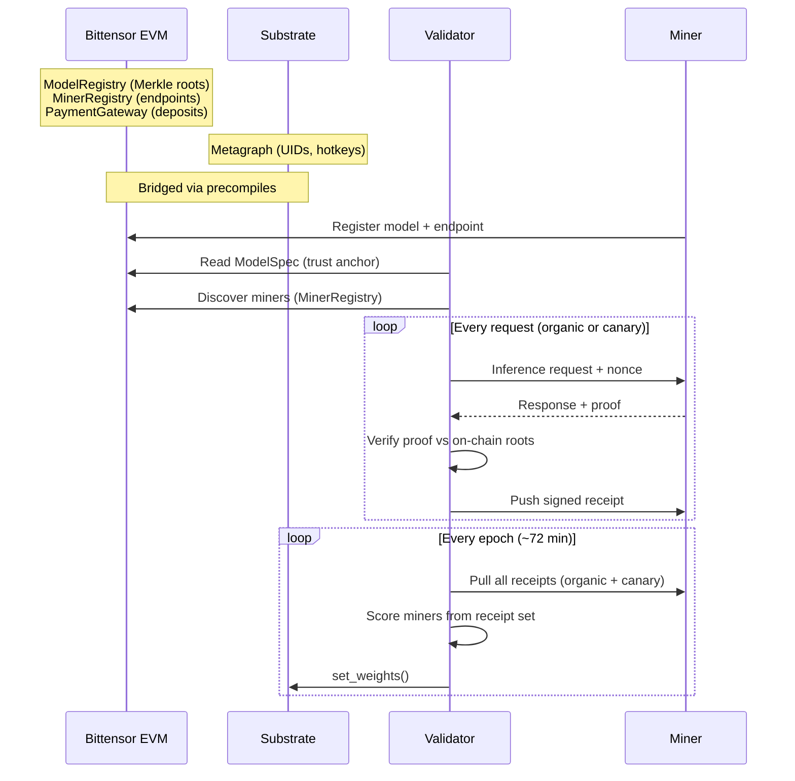

# Bittensor Integration

How Verathos operates as Bittensor Subnet 96: epoch lifecycle, scoring, weight setting, and miner/validator coordination.

For details on how proofs are generated and verified, see [Inference Verification Protocol](inference_protocol.md). Next up: intelligent routing for content-aware model selection (see [Active Research](research.md)). Training verification is in testing.

## Architecture



### On-chain contracts

| Contract | Purpose |
|----------|---------|
| **ModelRegistry** | Weight Merkle roots, the trust anchor for proof verification |
| **MinerRegistry** | Miner endpoints, heartbeats, model registrations |
| **PaymentGateway** | User deposits, treasury splits, staking |
| **UsageCheckpointRegistry** | On-chain usage snapshots for disaster recovery |

### Receipts

Every verified inference (organic or canary) produces a **signed receipt** with measured metrics (TTFT, tok/s, tokens, proof pass/fail). The validator signs the receipt with Ed25519 and pushes it to the miner. Miners accumulate receipts from ALL validators throughout the epoch. At epoch close, every validator pulls the full receipt set from each miner, ensuring all validators see the same data for Yuma consensus.

## Epoch Lifecycle

One epoch = **360 blocks × 12s = ~72 minutes**.

1. **Epoch start**: validator discovers all active miners from MinerRegistry, verifies identity (anti-hijacking challenge), plans canary tests
2. **During epoch**: dispatches canary tests at scheduled blocks, processes organic traffic, pushes signed receipts to miners
3. **Epoch close**: pulls ALL receipts from all miners, computes scores, updates EMA, sets weights on Substrate
4. **Weight setting**: `set_weights()` on Substrate with `version_key` for on-chain version gating

## Canary Tests

Canary tests are synthetic requests that the validator schedules throughout each epoch. They are **indistinguishable from real user traffic**, and miners cannot detect whether a request is a test.

**Why canaries exist on top of per-request verification:**

- **Context boundary testing**: organic traffic rarely hits the model's maximum context length. Full-context canaries verify the miner can actually serve at the claimed context window, not just short prompts.
- **Guaranteed scoring data**: a miner with no organic traffic still needs to be scored. Canaries ensure every miner gets enough data points for throughput and latency measurement every epoch.
- **Performance baselines**: canaries provide controlled conditions (known prompt sizes) for consistent cross-miner comparison, independent of organic traffic patterns.

### Schedule

- **12 small canaries** per miner per epoch (500-2000 input tokens, 100-300 output tokens)
- **1 full-context canary** per miner per epoch (~80% of max_context_len, 200 output tokens)
- Proof verification on all full-context canaries and **~30% of small canaries**
- Remaining small canaries still measure throughput and latency for scoring
- Tests spread evenly across the epoch for natural-looking traffic

Any proof failure (whether from organic traffic or a canary) triggers **instant score zeroing and probation**.

## Scoring

Miners are scored per epoch based on all receipts, both organic and canary:

```
SCORE = UTILITY × THROUGHPUT² × TTFT_FACTOR × SPEED_FACTOR × DEMAND_BONUS
```

### Utility

Based on model utility (MoE uses dense-equivalent params):

```
UTILITY = log2(params)^1.8 × log2(context/1K) × quant_quality × generation_quality
```

Quantization quality factors: BF16/FP16 = 1.0, FP8 = 0.98, INT8 = 0.95, INT4 = 0.90.

### Throughput (superlinear, sybil defense)

Total weighted tokens served this epoch, squared:

```
THROUGHPUT = (total_weighted_tokens / 1M)²
```

Output tokens are weighted 3× input (decode is sequential, prefill is parallel, reflecting actual GPU cost). Quadratic scoring is the key sybil defense:

| Instances | Combined score | Note |
|-----------|---------------|------|
| 1 (honest) | 100% | Full throughput |
| 2 (same GPU) | 50% | Barely profitable after 2× cost |
| 3 | 36% | Marginal gain ~11% per extra |

### TTFT factor (peer-relative)

Compares this miner's median TTFT against the model's peer median:

- Faster than peers → bonus (up to 2.0×)
- Slower than peers → penalty (sqrt curve)
- No peers → 1.0 (neutral)

### Speed factor (peer-relative)

Compares this miner's median decode speed (tok/s) against the model's peer median. Same bonus/penalty curve as TTFT factor.

### Demand bonus

Models with organic user traffic receive up to 20% bonus. Based on non-canary receipts: miners serving models that real users want are rewarded more.

### EMA smoothing

Scores are smoothed with an exponential moving average across epochs:

```
ema_score = α × epoch_score + (1 - α) × previous_ema
```

Default α = 0.2 (configurable via `--ema-alpha`). Higher = more responsive to recent performance.

### Emission burn

A configurable fraction of miner emissions is burned by redirecting weight to the subnet owner's UID. This prevents over-paying miners when network utilisation is low. The burn rate is stored on-chain in `SubnetConfig.emissionBurnBps` (default: 5000 = 50%).

At each weight-setting boundary the validator scales all miner weights by `(1 - burn_rate)` and assigns the remaining fraction to the burn UID. The subnet owner can adjust the burn rate on-chain without requiring a code update.

### Proof failure

Any proof failure = **instant score zero**. The miner enters probation (every subsequent request gets full proof verification, no probabilistic skipping) and is excluded from organic traffic routing. This is a hard cutoff, not a gradual penalty.

**Rehabilitation:** Pass 3 consecutive epochs with 100% proof success → probation lifted, organic traffic resumes.

### Detection timeline

With k=2 layers challenged per request on a 32-layer model, a cheater is caught within ~36 requests with 90% probability, and 99% after 72 requests. See [Inference Protocol: Detection Probability](inference_protocol.md#detection-probability) for the full analysis.

## Resource Requirements

### Validator

| Resource | Requirement |
|----------|-------------|
| GPU | **None** |
| RAM | 16 GB+ |
| CPU | 4+ cores, 2.0 GHz+ (verification ~4ms) |
| Storage | 50 GB+ SSD |
| Network | 100 Mbps up/down (HTTP to miners + WebSocket to Substrate) |
| Cost | ~$20/month VPS |

### Miner

| Resource | Requirement |
|----------|-------------|
| GPU | 24 GB+ VRAM (RTX 4090, RTX 3090/Ti, L4, A10) |
| CUDA | 12.8+ |
| RAM | 32 GB+ |
| CPU | 4+ cores, 2.5 GHz+ |
| Storage | 100 GB+ SSD (model weights + Merkle tree cache) |
| Network | 100 Mbps up/down (inbound HTTP, reverse proxy recommended) |
| OS | Ubuntu 22.04+ (or equivalent Linux) |

## Supported Models

All models registered on-chain in the Verathos ModelRegistry contract are supported. The registry is managed by the subnet owner and continuously expanded. Key architectures:

- **Dense**: Qwen3, Llama, Mistral, Gemma, DeepSeek distills, GPT-oss
- **MoE**: Qwen3-30B-A3B, Qwen3.5-35B-A3B, Qwen3-235B-A22B, DeepSeek-V3, Kimi-K2, Llama-4-Maverick

MoE models have expert routing verification built into the proof and handled automatically.

```bash
# See what models fit your GPU
python -m verallm.registry --recommend

# All available models
python -m verallm.registry --all
```

## Validator Gateway

> **Note:** The validator gateway is not yet publicly available. It will be released soon so every validator can run their own instance and earn from inference revenue. Currently, the official gateway runs at [api.verathos.ai](https://api.verathos.ai).

Validators will be able to run a gateway, the user-facing API endpoint:

- **OpenAI-compatible** `/v1/chat/completions`
- **Dual auth**: API key (prepaid credits) or x402 (USDC pay-per-request)
- **Score-weighted routing**: selects miners by score from validator shared state
- **Proof verification**: verifies every response before forwarding to user

See the [User Guide](user_guide.md) for the end-user perspective and the [API Reference](api.md) for endpoint documentation.

## See Also

- [Inference Verification Protocol](inference_protocol.md): how proofs are generated and verified
- [Setup Guide](setup.md): installation, PM2, logging, analytics, auto-update
