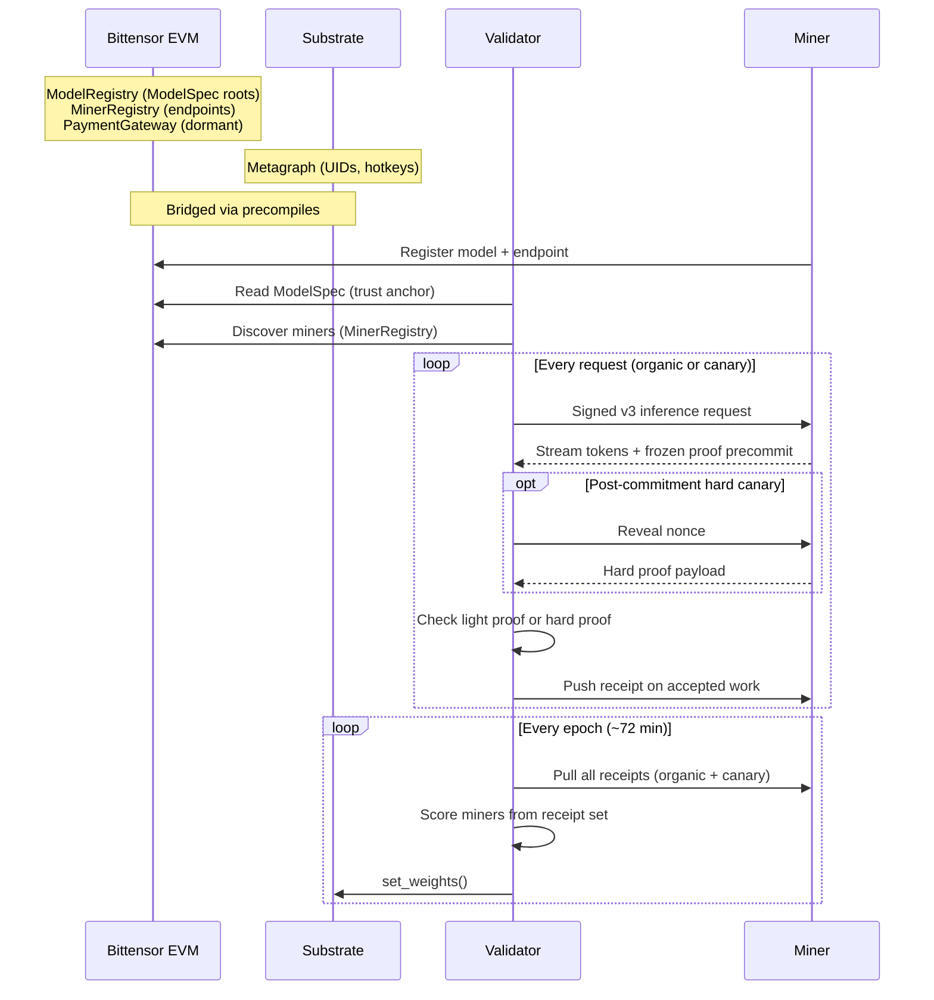

# Bittensor Integration

How Verathos operates as Bittensor Subnet 96: epoch lifecycle, scoring, weight setting, and miner/validator coordination.

For details on how proofs are generated and verified, see [Inference Verification Protocol](inference_protocol.md). Next up: intelligent routing for content-aware model selection (see [Active Research](research.md)). Training verification is in testing.

## Architecture


```mermaid
sequenceDiagram
    participant EVM as Bittensor EVM
    participant Sub as Substrate
    participant V as Validator
    participant M as Miner

    Note over EVM: ModelRegistry (ModelSpec roots)<br/>MinerRegistry (endpoints)<br/>PaymentGateway (dormant)
    Note over Sub: Metagraph (UIDs, hotkeys)
    Note over EVM,Sub: Bridged via precompiles

    M->>EVM: Register model + endpoint
    V->>EVM: Read ModelSpec (trust anchor)
    V->>EVM: Discover miners (MinerRegistry)

    loop Every request (organic or canary)
        V->>M: Signed v3 inference request
        M-->>V: Stream tokens + frozen proof precommit
        opt Post-commitment hard canary
            V->>M: Reveal nonce
            M-->>V: Hard proof payload
        end
        V->>V: Check light proof or hard proof
        V->>M: Push receipt on accepted work
    end

    loop Every epoch (~72 min)
        V->>M: Pull all receipts (organic + canary)
        V->>V: Score miners from receipt set
        V->>Sub: set_weights()
    end
```

### On-chain contracts

| Contract | Purpose |
|----------|---------|
| **ModelRegistry** | Model identity and canonical roots used to authenticate proof manifests |
| **MinerRegistry** | Miner endpoints, heartbeats, model registrations |
| **PaymentGateway** | Retained deployment; not used by the prepaid-credit runtime |
| **UsageCheckpointRegistry** | On-chain usage snapshots for disaster recovery |

### Receipts

Every accepted inference can produce a **signed receipt** with measured metrics
(TTFT, tok/s, tokens and the actual proof tier/verdict). A rejected protocol
exchange does not produce a success receipt or paid-usage settlement. Miners
accumulate accepted receipts from validators throughout the epoch. At epoch
close, validators pull receipt sets for scoring.

## Epoch Lifecycle

One epoch = **360 blocks × 12s = ~72 minutes**.

1. **Epoch start**: validator discovers all active miners from MinerRegistry, verifies identity (anti-hijacking challenge), plans canary tests
2. **During epoch**: dispatches canary tests at scheduled blocks, processes organic traffic, pushes signed receipts to miners
3. **Epoch close**: pulls ALL receipts from all miners, computes scores, updates EMA, sets weights on Substrate
4. **Weight setting**: `set_weights()` on Substrate with `version_key` for on-chain version gating

## Canary Tests

Canary tests use the same authenticated serving path and request shapes as user
traffic. Hard selection stays hidden until the response commitment is frozen.

**Why canaries exist on top of per-request verification:**

- **Context boundary testing**: organic traffic rarely hits the model's maximum context length. Full-context canaries verify the miner can actually serve at the claimed context window, not just short prompts.
- **Guaranteed scoring data**: a miner with no organic traffic still needs to be scored. Canaries ensure every miner gets enough data points for throughput and latency measurement every epoch.
- **Performance baselines**: canaries provide controlled conditions (known prompt sizes) for consistent cross-miner comparison, independent of organic traffic patterns.

### Schedule

- The designated auditor schedules **2 light + 1 hard** canary per endpoint per
  epoch under the signed policy.
- Other validators schedule light canaries and either authenticate the owner's
  exact-epoch verdict or explicitly replay retained hard bundles.
- Context and decode lengths come from the signed, secret-seeded canary policy.
- Tests are spread across the epoch; hard eligibility is not exposed in the
  initial request.

An invalid inference proof triggers the normal immediate proof-failure and
probation path. Hot-capacity audit penalties are applied only after the
validator confirms the audit's chain anchors are finalized.

## Scoring

Miners are scored per epoch based on all receipts, both organic and canary:

```
SCORE = UTILITY × THROUGHPUT² × TTFT_FACTOR × SPEED_FACTOR × DEMAND_BONUS
```

### Utility

Based on model utility (MoE uses dense-equivalent params):

```
UTILITY = log2(params)^1.8 × log2(context/1K) × quant_quality × generation_quality
```

Quantization quality factors: BF16/FP16 = 1.0, FP8 = 0.98, INT8 = 0.95, INT4 = 0.90.

### Throughput (superlinear, sybil defense)

Total weighted tokens served this epoch, squared:

```
THROUGHPUT = (total_weighted_tokens / 1M)²
```

Output tokens are weighted 3× input (decode is sequential, prefill is parallel, reflecting actual GPU cost). Quadratic scoring is the key sybil defense:

| Instances | Combined score | Note |
|-----------|---------------|------|
| 1 (honest) | 100% | Full throughput |
| 2 (same GPU) | 50% | Barely profitable after 2× cost |
| 3 | 36% | Marginal gain ~11% per extra |

### TTFT factor (peer-relative)

Compares this miner's median TTFT against the model's peer median:

- Faster than peers → bonus (up to 2.0×)
- Slower than peers → penalty (sqrt curve)
- No peers → 1.0 (neutral)

### Speed factor (peer-relative)

Compares this miner's median decode speed (tok/s) against the model's peer median. Same bonus/penalty curve as TTFT factor.

### Demand bonus

Models with organic user traffic receive up to 20% bonus. Based on non-canary receipts: miners serving models that real users want are rewarded more.

### EMA smoothing

Scores are smoothed with an exponential moving average across epochs:

```
ema_score = α × epoch_score + (1 - α) × previous_ema
```

Default α = 0.2 (configurable via `--ema-alpha`). Higher = more responsive to recent performance.

### Emission burn

A configurable fraction of miner emissions is burned by redirecting weight to the subnet owner's UID. This prevents over-paying miners when network utilisation is low. The burn rate is stored on-chain in `SubnetConfig.emissionBurnBps` (default: 5000 = 50%).

At each weight-setting boundary the validator scales all miner weights by `(1 - burn_rate)` and assigns the remaining fraction to the burn UID. The subnet owner can adjust the burn rate on-chain without requiring a code update.

### Proof failure

An invalid required hard proof enters the immediate failure/probation path and
removes the endpoint from normal organic routing. Maintenance grace can
temporarily suppress configured consequences during a coordinated update, but
the real verdict remains recorded.

**Rehabilitation:** Pass 3 consecutive epochs with 100% proof success → probation lifted, organic traffic resumes.

Detection probability depends on the signed profile, selected relation set and
the deviation being tested. The protocol does not advertise a single generic
per-request percentage for every form of substituted execution.

## Resource Requirements

### Validator

| Resource | Requirement |
|----------|-------------|
| GPU | **None** |
| RAM | 16 GB+ |
| CPU | Modern multi-core CPU; hard-proof verification is profile-dependent |
| Storage | 50 GB+ SSD |
| Network | 100 Mbps up/down (HTTP to miners + WebSocket to Substrate) |
| Cost | ~$20/month VPS |

### Miner

| Resource | Requirement |
|----------|-------------|
| GPU | 24 GB+ VRAM (RTX 4090, RTX 3090/Ti, L4, A10) |
| CUDA | 12.8+ |
| RAM | 32 GB+ |
| CPU | 4+ cores, 2.5 GHz+ |
| Storage | 100 GB+ SSD (model weights + Merkle tree cache) |
| Network | 100 Mbps up/down (inbound HTTP, reverse proxy recommended) |
| OS | Ubuntu 22.04+ (or equivalent Linux) |

## Supported Models

All models registered on-chain in the Verathos ModelRegistry contract are supported. The registry is managed by the subnet owner and continuously expanded. Key architectures:

- **Dense**: Qwen3, Llama, Mistral, Gemma, DeepSeek distills, GPT-oss
- **MoE**: Qwen3-30B-A3B, Qwen3.5-35B-A3B, Qwen3-235B-A22B, DeepSeek-V3, Kimi-K2, Llama-4-Maverick

MoE models have expert routing verification built into the proof and handled automatically.

```bash
# See what models fit your GPU
python -m verallm.registry --recommend

# All available models
python -m verallm.registry --all
```

## Validator Gateway

> **Note:** The validator gateway is not yet publicly available. It will be released soon so every validator can run their own instance and earn from inference revenue. Currently, the official gateway runs at [api.verathos.ai](https://api.verathos.ai).

Validators will be able to run a gateway, the user-facing API endpoint:

- **OpenAI-compatible** `/v1/chat/completions`
- **Dual auth**: API key (prepaid credits) or x402 (USDC pay-per-request)
- **Score-weighted routing**: selects miners by score from validator shared state
- **Verification metadata**: returns the light-proof or hard-audit result
  applicable to the request; hard execution audits are selected unpredictably

See the [User Guide](user_guide.md) for the end-user perspective and the [API Reference](api.md) for endpoint documentation.

## See Also

- [Inference Verification Protocol](inference_protocol.md): how proofs are generated and verified
- [Setup Guide](setup.md): installation, PM2, logging, analytics, auto-update
