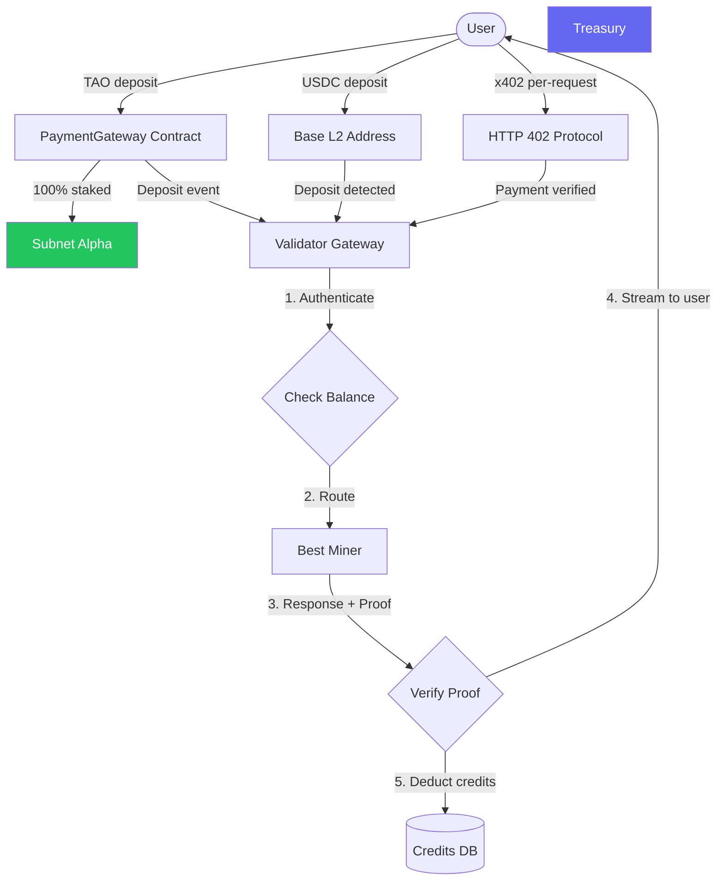
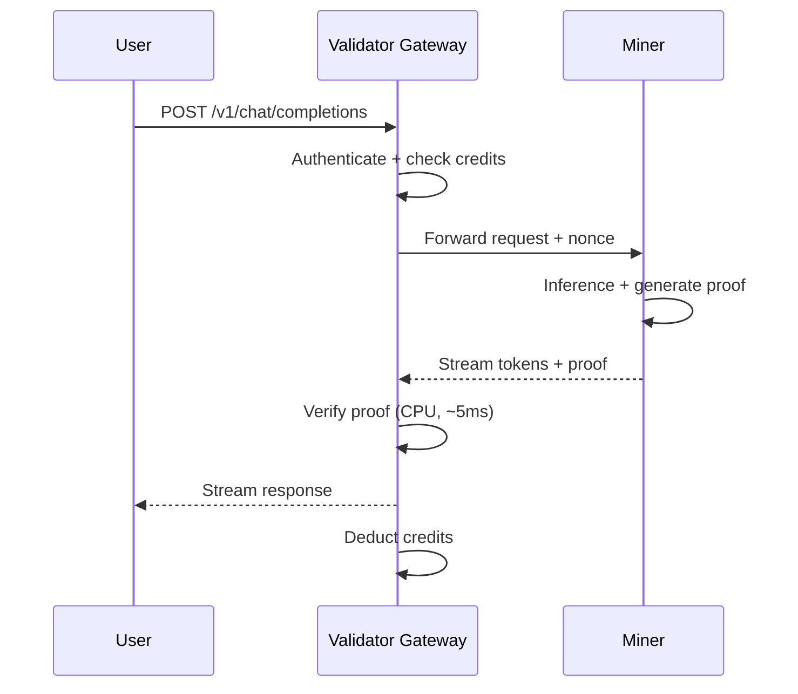
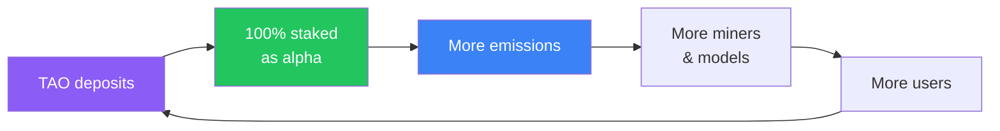

# Economic Model: Verathos Subnet

> Economic design for the Verathos verified AI compute subnet on Bittensor,
> covering payment mechanics, alpha token economics, dual-currency credits,
> request routing, and growth strategy.

---

## Core Value Proposition

Verathos **cryptographically proves** that a miner performed the exact
computation (whether inference or training) with the exact model weights,
on the actual input, at production speed. This is not statistical sampling or
redundant re-execution. It is a mathematical proof generated in 10–100 ms
with 50–100 KB overhead, verified on CPU in milliseconds.

**Why this matters economically:**

- **Validators don't need GPUs**: verification is CPU-only (~5–20 ms). This
  is a direct consequence of how the protocol executes: there is no need for
  expensive GPU-based re-execution, complex verification sharing, or
  centralized validator architectures. Any machine can verify any proof. This
  eliminates the single-validator bottleneck that other inference networks
  depend on and grounds the path toward real decentralization, not only on
  the compute provider level, but also verification and ultimately governance.
- **No redundant compute**: one miner runs the computation, everyone can verify.
  Unlike approaches that require multiple miners to compute the same result
  or validators to re-run the computation, every GPU cycle here is productive.
- **Cheating is cryptographically constrained, not just economically disincentivized**: a miner
  that substitutes weights or fabricates activations faces an exponentially increasing probability
  of detection with each request. The sumcheck protocol and Merkle commitments make undetected cheating
  a statistical near-impossibility in practice, without relying on economic penalties alone.
- **Transparent and auditable**: model weight Merkle roots are anchored
  on-chain via the Bittensor EVM ModelRegistry. Anyone can independently verify
  that a serving miner is running the exact claimed model: download the weights,
  recompute the Merkle root, and compare against the on-chain record. No trust
  in the operator required.

This enables **verified AI compute as a service**, inference and training with
trust guarantees that no centralized provider can match. Users don't trust the
provider; they verify.

---

## Revenue Model

The subnet sells verified AI compute to external users (developers, companies,
AI applications). Every request is verified by the protocol. Revenue flows into
the subnet's alpha token, amplifying Bittensor emissions for all participants.

**Every response is verified.** The validator cryptographically verifies every
inference request; this is not optional and happens transparently. Every
response includes a verification status confirming the proof passed.

By default, the full proof bundle is included in the response for
auditability. For high-volume API usage, proof details can be disabled
per-request to save bandwidth.

For industries that require input privacy (medical records, financial data),
TEE mode is optionally available: inference runs inside a hardware enclave
and the miner never sees the plaintext. TEE adds hardware-level privacy on
top of the standard cryptographic verification.

---

## Payment Architecture

### Design Principles

- **Dual-currency payments**: users pay in **TAO** (on-chain deposit via PaymentGateway contract) or **USDC** (on Base L2, or per-request via x402 protocol). No token swaps required for either path.
- **100% of TAO deposits buy and stake alpha**, creating maximum structural positive flow into the subnet. The owner cut starts at 0% and can be increased up to 20% via the PaymentGateway contract if needed to fund infrastructure and operations.
- **Validators are gateways**: each validator runs a user-facing API, manages credits, routes requests, and verifies proofs.
- **On-chain deposits, off-chain usage tracking**: deposits are trustless (smart contract or L2 bridge). Usage accounting is off-chain (per-validator DB) to avoid gas costs on every request.

### High-Level Flow



On each API request, the validator authenticates the user, checks balance, routes to the best miner, verifies the proof on CPU, streams the response, and deducts credits (USD first, TAO fallback).

### Why Validators as Gateways?

Validators are the natural gateway because they already:

- Know all active miners (read MinerRegistry on-chain)
- Track miner performance (canary test throughput, proof pass rate)
- Verify proofs (the core protocol)
- Set weights on-chain (Bittensor's emission mechanism)

Adding user-facing API + credit management is a small extension. This avoids
introducing a separate gateway entity and keeps the architecture aligned with
Bittensor's validator-centric design.

**Credits are per-validator.** When a user deposits TAO and specifies a
validator hotkey, that validator tracks their credit balance. If the user wants
to use a different validator, they deposit separately to that validator. This
is simple and avoids cross-validator coordination.

**Validator discovery:** Users discover validators through the [Verathos webapp](https://verathos.ai), the on-chain ValidatorRegistry, or `GET /v1/network/stats` on any gateway.

---

## Smart Contracts

### PaymentGateway

Handles trustless payment deposits alongside the ModelRegistry and MinerRegistry contracts on Bittensor EVM.

**Contracts on-chain:** ModelRegistry (weight Merkle roots), MinerRegistry (miner endpoints per model), PaymentGateway (deposits, alpha staking, treasury split).

```solidity
contract PaymentGateway {

    address public ownerTreasury;
    uint16  public subnetId;
    uint16  public ownerCutBps;          // 0 = 0% (configurable, max 20%)

    event Deposit(
        address indexed user,
        bytes32 indexed validatorHotkey,
        uint256 taoAmount,
        uint256 creditAmount
    );

    function deposit(bytes32 validatorHotkey) external payable {
        require(msg.value > 0, "zero deposit");

        uint256 ownerCut = (msg.value * ownerCutBps) / 10000;
        uint256 alphaCut = msg.value - ownerCut;

        payable(ownerTreasury).transfer(ownerCut);

        // Stake remainder as alpha via Bittensor staking precompile
        IStaking(STAKING_PRECOMPILE).addStake(subnetId, alphaCut);

        emit Deposit(msg.sender, validatorHotkey, msg.value, msg.value);
    }
}
```

**Key design choices:**

| Choice | Rationale |
|--------|-----------|
| Dual-currency credits (TAO + USD) | TAO deposits flow through the contract (alpha staking). USDC deposits tracked off-chain. Pricing in USD, converted to TAO at market rate for TAO-paying users. |
| No on-chain credit balance | Credits derived from deposit events. Validators sum deposits and subtract usage locally. Avoids on-chain writes per request. |
| Alpha staking via precompile | Uses Bittensor's native staking mechanism. Staked alpha generates emissions. |
| Validator-specific deposits | Simple accounting. No cross-validator settlement needed. |

### Alpha Staking

Each TAO deposit is staked into the subnet via the Bittensor staking precompile (100% by default, minus any owner cut if configured):

- TAO is converted to alpha tokens at the current subnet exchange rate
- The alpha is staked, contributing to the subnet's total stake
- Higher total stake attracts more TAO emissions from the root network
- The staked alpha is held by the PaymentGateway contract address

The contract address becomes one of the largest stakers in the subnet,
creating persistent positive alpha flow that scales linearly with user demand.

---

## Credit System & Accounting

### Dual-Currency Credits

The system supports two independent credit balances per user:

| Currency | Source | Precision | Storage |
|----------|--------|-----------|---------|
| **TAO** | PaymentGateway deposit on Bittensor EVM | Wei (10⁻¹⁸ TAO) | `total_deposited_wei` / `total_consumed_wei` |
| **USD** | USDC deposits on Base L2 | Microdollars (10⁻⁶ USD, matches USDC 6 decimals) | `total_deposited_usd_micros` / `total_consumed_usd_micros` |

**Deduction priority:** All costs are computed in USD first (via the pricing oracle). When both balances exist, USD is deducted first. If USD balance is insufficient, the full cost is converted to TAO at the current market rate and deducted from TAO balance instead.

### Credit Lifecycle

1. **Deposit**: User deposits TAO (via PaymentGateway) or USDC (via Base L2 transfer). Validator detects the deposit and credits the balance.
2. **Usage**: User makes API requests. Validator computes USD cost (model pricing x token count), deducts from USD first, TAO fallback.
3. **Balance check**: `GET /v1/balance` returns both TAO and USD balances.
4. **Withdrawal**: User withdraws unconsumed TAO or USDC via `POST /v1/user/withdraw`. Only the on-chain balance (minus gas) is withdrawable.
5. **Exhaustion**: When balance < minimum request cost, validator returns 402.
6. **x402 alternative**: User includes USDC payment header per-request. No deposit required.

### TAO/USD Price Oracle

Pricing is denominated in **USD** and converted to TAO at the live market
rate when deducting from TAO balances:

- **Source:** CoinGecko API
- **Cache:** 300 seconds (5 minutes)
- **Stale threshold:** 1 hour (uses stale cache if API is down)
- **Fallback:** Static fallback price if cache is empty and API unreachable

TAO-paying users see a stable USD-equivalent cost per request, while TAO
balance consumption adjusts to market rate fluctuations.

### Validator-Side Storage

Each validator maintains a database (PostgreSQL for production):

- **users**: user ID, wallet address, API key hash, TAO/USD deposit and consumption totals
- **usage_log**: per-request model, tokens, cost, timestamp

On startup, the validator replays all `Deposit` events from the PaymentGateway
contract to rebuild TAO balances. USDC balances are synced from Base L2 deposit
records. The chain is the source of truth for deposits; the local DB is the
source of truth for usage.

**Disaster recovery:** The `UsageCheckpointRegistry` contract records
cumulative usage on-chain per epoch (~72 min). If the DB is lost, consumed
amounts can be recovered from chain to within one epoch of accuracy.

### User Withdrawals

Users can withdraw unconsumed TAO or USDC at any time via `POST /v1/user/withdraw`. Only the on-chain deposit balance minus gas estimate is withdrawable (not the full credit balance, which may include amounts already consumed but not yet settled).

- **TAO**: supports both SS58 (`5...`) and EVM (`0x...`) destination addresses. SS58 withdrawals use the `ISubtensorBalanceTransfer` precompile (0x0800) internally.
- **USDC**: destination must be a Base EVM address. The validator auto-funds gas (ETH) to the user's deposit address for the ERC-20 transfer.
- **Minimums:** 0.01 TAO, $1 USDC.
- **Rate limit:** 1 withdrawal per 5 minutes per user.

---

## Request Routing



If the proof fails: the miner is scored zero, the user is not charged, and the request is re-routed to another miner.

### Why Users Don't Pick Miners

Users don't interact with miners directly:

- **Trust**: the validator verifies proofs on the user's behalf
- **Routing**: the validator knows miner performance and makes optimal decisions
- **Simplicity**: one OpenAI-compatible endpoint, complexity hidden

### Validator Selection

Users choose a validator based on geographic proximity, uptime, and supported models. The subnet provides a recommended default validator for onboarding. Credits are per-validator; to switch, withdraw unconsumed TAO and deposit to the new validator.

---

## Alpha Token Economics & Flywheel

### How Bittensor Emission Works

In Bittensor's dynamic TAO:

- Each subnet has an **alpha token**
- Staking TAO into a subnet buys alpha at the current exchange rate
- More TAO staked → higher alpha price → more TAO emissions directed to the subnet
- Emissions are split: **41% miners, 41% validators, 18% subnet owner**
- **Emission burn:** the subnet burns a configurable fraction (default 50%) of miner emissions by redirecting weight to the subnet owner UID. This prevents over-paying miners when utilisation is low and creates deflationary pressure on the alpha token.
- Net positive alpha flow signals demand to the root network

### The Revenue → Alpha → Emission Flywheel

Every TAO deposit creates structural, permanent alpha buy pressure:



**Key insight:** The alpha bought by the contract stays staked. It doesn't get sold, creating a monotonically increasing stake floor that only grows with usage. This is not speculative; it is driven by real compute demand.

### Why Miners Are NOT Paid Directly from Revenue

The current design routes 100% of TAO revenue to alpha buyback instead of paying miners directly:

| Approach | Direct Miner Payment | Alpha Buyback |
|----------|---------------------|---------------|
| Alpha buy pressure | Diluted (only partial buyback) | Maximized (100% of revenue) |
| Miner payment | Two sources (revenue + emission) | Single source (emission only) |
| Incentive alignment | Complex (competing systems) | Clean (validator weights determine pay) |

Miners are paid through Bittensor's native emission mechanism. Validators
score miners via epoch-based canary testing. Better miners get higher weights
→ more emission.

---

## Participant Incentives

### Miners (GPU Operators)

**Earnings:** 41% of subnet emissions (determined by validator weights).

**What they do:**
- Run models for inference with cryptographic proofs (training in testing)
- Register on MinerRegistry contract
- Maintain uptime (heartbeat every 12 hours)

**Why they join:**
- Emissions scale with user demand (revenue drives alpha buyback drives emissions)
- Multi-model capability: register multiple model endpoints per hotkey, scores accumulate
- Revenue-backed emissions are more predictable than pure-speculation subnets

### Validators

**Earnings:** 41% of subnet emissions.

**What they do:**
- Run user-facing API gateway
- Route requests to miners (score-weighted)
- Verify proofs (CPU-only, ~5–20 ms)
- Score miners → set weights on-chain
- Manage user credits

**Costs:** Minimal. A $20/month VPS handles thousands of verifications per second.

### Subnet Owner

**Earnings:** 18% of subnet emissions. TAO deposit owner cut starts at 0% (configurable up to 20% via PaymentGateway).

**Responsibilities:**
- Maintain the protocol and codebase
- Onboard new models to the registry
- Alpha staking via PaymentGateway (automatic)
- Community, marketing, business development

### Users

**What they get:**
- Verified AI compute with cryptographic proof (inference live, training in testing)
- OpenAI-compatible API (drop-in replacement)
- Access to 50+ open-weight models
- Competitive pricing

**Payment:** Deposit TAO or USDC, or use x402 pay-per-request.

### Investors / Alpha Holders

**Why hold alpha:**
- Subnet has real revenue (not just emission farming)
- 100% of TAO revenue structurally buys and stakes alpha
- Staking alpha earns emissions
- Alpha price floor grows with cumulative user deposits

---

## User Access

The gateway exposes an **OpenAI-compatible API**, a drop-in replacement for any OpenAI SDK, LangChain, LiteLLM, Cursor, Continue, etc. See the [User Guide](user_guide.md) for API key setup, deposits, and code examples.

The [Verathos webapp](https://verathos.ai/chat) provides interactive chat with live proof verification, a model browser, and balance/usage dashboard.

---

## Pricing

### Per-Token Pricing (in USD)

Pricing is denominated in **USD per million tokens**. Each model has an
explicit pricing entry; unknown models fall back to tier-based pricing.
Prices may be adjusted over time as the network grows, and model-specific pricing will eventually replace the tier-based defaults.

| Tier | Example Models | Input ($/1M tokens) | Output ($/1M tokens) |
|------|---------------|---------------------|----------------------|
| Small (≤8B) | Qwen3-8B, Qwen3.5-9B, Llama-8B, Mistral-7B | $0.08 | $0.14 |
| Medium (14–32B) | Qwen3-14B, Gemma-27B, Qwen3.5-35B-A3B | $0.20 | $0.35 |
| Large (70–122B) | Llama-3.3-70B, Qwen3.5-122B-A10B | $0.35 | $0.65 |
| XL (100B+) | DeepSeek-V3, Qwen3-235B-A22B, Llama-4-Maverick | $0.50 | $1.20 |

Every request is verified by the validator; verification cost is included
in the base price. Set `include_proof: false` in the request to omit the
proof bundle from the response and save bandwidth.

**TAO conversion:** For TAO-paying users, the USD cost is converted at the
live market rate via the CoinGecko oracle.

---

## Growth Strategy

### Phase 1: Bootstrap

**Goal:** Prove the system works, attract initial users.

- Launch with popular models across multiple GPU tiers
- Subnet team runs initial miner + validator nodes
- Free signup credits for early adopters
- Alpha buyback active from day 1

### Phase 2: Product-Market Fit

**Goal:** Prove demand beyond crypto-native users.

- OpenAI-compatible endpoint as drop-in replacement
- Target AI startups building on open models
- Intelligent routing: learned model selection based on query content and complexity
- Launch verified tier for compliance use cases

### Phase 3: Scale

**Goal:** Compete with centralized inference providers.

- Large models (70B+, MoE) across the miner network
- Geographic distribution for low latency
- Independent validators join (attracted by emission share)
- Verified training enables domain-specialized miners and fine-tuning marketplace

### Phase 4: Moat

**Goal:** Make the network irreplaceable.

- 50+ models with on-chain Merkle roots = trust anchor network effect
- Cross-subnet composability: other subnets use Verathos for verified compute
- See [Active Research](research.md) for the long-term vision

---

## Risks & Mitigations

### Economic Risks

| Risk | Mitigation |
|------|------------|
| **Low initial demand** | Subnet team runs miners + funds free tier from treasury. Bootstrap relies on emissions. |
| **TAO price volatility** | USD pricing with live oracle. Per-request cost stable in USD. USDC users unaffected. |
| **Validator monopoly** | Multiple validators compete on uptime/latency. Protocol allows any validator as gateway. |
| **Competitor fork** | On-chain Merkle roots for 50+ models are the moat. First-mover advantage in model coverage. |

### Technical Risks

| Risk | Mitigation |
|------|------------|
| **Proof overhead** | Current overhead ~1–8% depending on model size. GPU-accelerated CUDA extensions. |
| **Validator downtime** | Unconsumed TAO can be withdrawn at any time. On-chain usage checkpoints enable disaster recovery of credit state. Users can deposit to a different validator if needed. |
| **Smart contract bug** | Conservative limits. Upgrade via proxy pattern. |

---

## Summary

The Verathos economic model: **every unit of user demand flows into the subnet's alpha token.** 100% of TAO revenue buys alpha, emissions increase, miners and validators earn more, more participants join, more models become available, more users come. No direct miner payments; Bittensor's native emission mechanism handles distribution. The smart contract handles alpha staking automatically.

The result is a flywheel where **real usage drives real alpha demand drives real emissions**, creating a subnet economy backed by actual compute revenue.

---

## Related Documents

- [Bittensor Integration](bittensor_integration.md): Validator scoring, weight-setting, miner discovery
- [Inference Protocol](inference_protocol.md): Proof generation & verification protocol
- [Active Research](research.md): Intelligent routing, verified training, long-term vision
- [Active Research](research.md): Long-term research directions
- [API Reference](api.md): HTTP API specification
- [User Guide](user_guide.md): End-user guide
