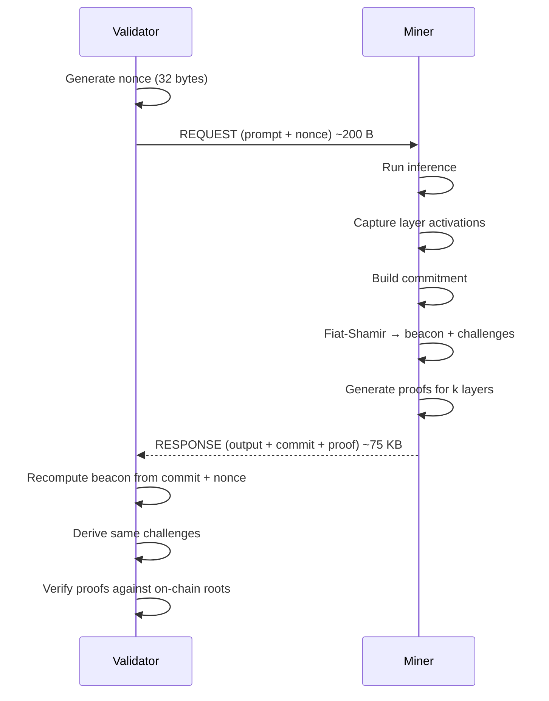

# Inference Verification Protocol

How Verathos cryptographically verifies that miners run the correct model and compute results honestly, without the validator needing a GPU.

## Overview

The Verathos inference protocol is a probabilistic verification system for LLM inference. It proves that a miner ran a specific model with committed weights, without the validator needing to run the model.

**Key Properties:**
- **Non-interactive:** Fiat-Shamir transform eliminates challenge-response round trips
- **Lightweight validators:** only need ~1KB of on-chain weight commitments, no model or GPU
- **Probabilistic detection:** ~6% per request, converges to 99%+ over multiple requests
- **All quantizations:** FP16, FP8, INT8, INT4 (GPTQ, AWQ, NF4), MXFP4, all unified into a single proof pipeline
- **Dense + MoE:** full support for Mixture-of-Experts with expert routing verification

**How it works in a nutshell:** During inference, the miner captures Merkle commitments over layer activations and outputs. A deterministic challenge, derived from the commitment and a validator-provided nonce, selects k random layers to prove. For each challenged layer, the miner generates a GEMM proof that verifies the tensor operation Y = X × W against committed weight Merkle roots. The validator checks these proofs against on-chain Merkle roots in milliseconds, without needing the model or heavy computation.

---

## Threat Model

Verathos is a **cryptoeconomic verification protocol**: cryptographic proofs combined with on-chain probation make honest serving the dominant strategy for an economically motivated operator. The adversary is a miner optimizing emissions relative to compute cost, looking for the cheapest serving strategy that still passes verification. Detection triggers probation: 100% proof rate, score zeroed, organic traffic stopped, three consecutive clean epochs required to recover.

Verification is designed so that every cheaper-than-honest strategy is caught with cumulative probability sufficient to make expected emissions loss exceed expected compute savings. Adversaries willing to spend more compute than honest serving in order to manipulate outputs are out of scope; that case is covered by the [TEE Verification](#tee-verification-trusted-execution-environments) path.

### Cheating strategies

| Strategy | Status | Mechanism |
|---|---|---|
| Smaller model served under the registered `model_id` | Impossible | Weight Merkle root mismatch at startup |
| Lower precision than registered (e.g. INT4 instead of INT8) | Impossible | Weight root commits to quantized bytes; precision change produces a different root |
| Skipped layers, forged intermediate activations | Detected | Sampled layer challenges, activation Merkle commitments, chained layer-transition hashes |
| Partial computation, forged remainder | Detected | Sumcheck on sampled blocks forces honest computation on any block that might be challenged |
| Cached responses across distinct prompts | Detected | Per-request beacon binds the proof to the specific prompt and nonce |
| Biased greedy sampling | Detected | Argmax verification against committed `lm_head` output at challenged decode positions |
| Biased stochastic sampling (`do_sample=True`) | Detected | Canonical CPU sampler with committed seed; validator replays the sample on opened `lm_head` logits and verifies the chosen token |
| Substituted sampling parameters (`top_k`, `top_p`, `min_p`) | Detected | `sampler_config_hash` binds the actual sampling parameters into the commitment; validator checks the hash matches the requested parameters |
| Skipped non-linearities (RMSNorm, SiLU, softmax) | Detected | Activation Merkle commitments and verifier recomputation on challenge |
| Substituted tokenizer (different `tokenizer.json` or chat template) | Detected | `tokenizer_hash` anchored on-chain at model registration; mismatched local tokenizer is flagged at validator startup |
| Smaller model served under a different `model_id` | No upside | Earns the smaller model's emissions; not profitable |
| Output manipulation while running the model honestly | Out of scope | Costs more compute than honest serving; not an economic attack |

### Parameter rationale

The defaults in the sections below follow from the threat model.

| Choice | Reason |
|---|---|
| `k = 2` of `N = 32` layers per request | Cumulative epoch-level detection drives the security argument, not per-request detection |
| Non-linearities recomputed at the verifier rather than proved | Activation commitments bind inputs and outputs; recomputation on challenge is sufficient |
| `25` Fiat-Shamir-derived weight spot checks per block | Forging weights that agree on unpredictable positions has negligible probability |
| Validators hold only on-chain Merkle roots, never weights | No per-validator state, no secrets, no model downloads, instant bootstrap |
| Stochastic sampling enforced via canonical CPU replay | A miner cannot bias the sampling distribution: the chosen token is bit-exactly replayable from the committed seed and the proven `lm_head` logits |
| Tokenizer integrity anchored on-chain | Mismatch between a validator's local tokenizer and the registered hash is attributed to the validator (not the miner), preventing false probation from local drift |

---

## Protocol Flow



**Total: 2 messages, no round-trips.** The challenge is derived deterministically from the output commitment and validator nonce via Fiat-Shamir, so the miner cannot predict which layers will be challenged before inference is complete.

---

## What Gets Verified

Every inference produces a proof bundle that binds the following properties. Each row is enforced cryptographically; the validator does not need to trust the miner for any of them.

| Component | Verification |
|-----------|-------------|
| **Weight correctness** | Merkle paths prove weight values match on-chain committed roots. Wrong model = caught immediately. |
| **Computation correctness** | Sumcheck proof verifies Y = X × W mathematically for each challenged layer. The prover and verifier agree on the result via Fiat-Shamir. |
| **Activation integrity** | Spot checks verify input activation values against committed Merkle roots. Fabricated activations are caught. |
| **Output binding** | SHA-256 output commitment is bound into the Fiat-Shamir transcript. Tampering with output invalidates the proof. |
| **Input binding** | 3-phase embedding proof: (1) weight row Merkle proofs against on-chain `embeddingRoot`, (2) embedding output cross-check, (3) layer transition hash chain. Prevents prompt substitution (miner cannot swap a cheaper prompt). |
| **Prompt hash** | SHA-256 of the canonical message JSON is committed. Validator recomputes from the prompt it sent and compares. |
| **Sampler config binding** | `top_k`, `top_p`, `min_p` are committed via SHA-256 (`sampler_config_hash`). The validator recomputes the hash from the parameters it requested, and any substitution by the miner is rejected. |
| **Greedy sampling correctness** (`temperature=0`) | At Fiat-Shamir-challenged decode positions, the validator opens the `lm_head` logits row from the proof and checks that the committed token equals the argmax. |
| **Stochastic sampling correctness** (`do_sample=True`) | The miner generates a 32-byte seed per request and commits its SHA-256 in the inference commitment **before** inference runs. A canonical CPU sampler runs every decode step bound to that seed; vLLM's GPU sampler is forced to the canonical choice. At challenged positions the validator opens the seed, runs the same canonical sampler on the proven `lm_head` logits, and verifies the chosen token matches. The sampling distribution cannot be biased without the replay diverging. |
| **Tokenizer integrity** | The `tokenizer.json` bytes plus `chat_template` are hashed (`tokenizer_hash`) and anchored on-chain at model registration. Validators recompute the hash from their local tokenizer files at epoch start; on mismatch the model is marked as drifted and proof verification is skipped (validator-side issue, the miner is **not** penalized). This prevents false probation from local tokenizer drift between validators. |

---

## Security Model

| Attack | Why it fails |
|--------|-------------|
| Use wrong model weights | Weight Merkle roots are committed on-chain. Proof verification checks against these roots. |
| Fabricate activations | Spot checks verify activation values against committed Merkle roots. |
| Skip layers | Must prove computation with correct weights for challenged layers. |
| Run cheaper model | Different weights = different commitments = caught on any challenged layer. |
| Substitute prompt | Input binding proves the embedding layer processed the correct prompt via on-chain `embeddingRoot`. |
| Substitute sampling parameters | `sampler_config_hash` binds `top_k`/`top_p`/`min_p` into the commitment. The validator recomputes the hash from the parameters it requested. |
| Bias the stochastic sampling distribution | The chosen token is determined by a canonical CPU sampler keyed to a seed committed before inference. The validator replays the canonical sample on the proven logits, and divergence is rejected. |
| Validator's local tokenizer drifts from canonical | `tokenizer_hash` is anchored on-chain at registration. Validator startup check detects drift and attributes it locally, never penalizing the miner. |
| Grind for easy challenges | Nonce is fixed before inference. Commitment depends on actual activations. No degrees of freedom. |

The last point is critical: the validator sends a nonce with each request, and the challenge is derived deterministically from the nonce and the miner's output commitment. The miner cannot change the nonce, cannot predict the commitment before inference, and therefore cannot influence which layers are challenged.

---

## Detection Probability

Once a layer is challenged, verification is **deterministic** (Merkle proofs + sumcheck). The only randomness is which k layers are sampled.

If a miner cheats on any layer:

```
P(detect per request) = k / N
P(detect after M requests) = 1 - (1 - k/N)^M
```

### Cumulative detection (k=2, N=32 layers)

| Requests | Detection probability |
|----------|---------------------|
| 1 | 6.25% |
| 10 | 48% |
| 36 | 90% |
| 72 | 99% |

**At 10 requests/minute, cheaters are caught within ~4 minutes with 90% probability.**

---

## Quantization Support

All quantization modes are supported through a unified proof pipeline:

| Mode | How it works |
|------|-------------|
| FP16/BF16 | Scaled to integers for exact verification |
| INT8 | Native integer format, direct proof |
| INT4 (GPTQ, AWQ, NF4) | Unpacked to INT8 for proof generation |
| FP8 | Converted to INT8 proof representation |
| MXFP4 | Decompressed via Marlin, proven as INT8 |

The key insight: all proofs operate on integer representations regardless of the serving quantization. This makes the proof pipeline uniform and eliminates floating-point non-determinism.

---

## MoE (Mixture-of-Experts) Support

MoE models are auto-detected and verified with additional expert-specific challenges:

1. For each challenged MoE layer, sample token positions
2. Verify the router's expert selection matches committed routing
3. Challenge selected experts' GEMMs (gate, up, down projections)
4. Shared experts (DeepSeek-style) are challenged independently

MoE models with hundreds of experts (e.g., Qwen3-30B-A3B with 128 experts) are fully supported. Per-expert Merkle trees enable efficient verification without loading all expert weights.

---

## On-Chain Data

### ModelSpec (published once per model)

The subnet owner computes weight Merkle roots and publishes them on-chain (~1-4 KB per model):
- Overall model commitment (32 bytes)
- Per-layer weight Merkle roots (32 bytes × num_layers)
- Per-expert Merkle roots for MoE models
- Embedding weight root (input binding anchor)
- `lm_head` weight root (output projection anchor for sampling proofs)
- Tokenizer hash (`tokenizer.json` + chat template): drift-detection anchor for validators
- Architecture metadata (layers, dimensions, quantization)

Validators read ModelSpec from chain. This is the trust anchor. Miners cannot forge weight roots, and validators detect their own tokenizer drift before it can produce false miner failures.

### Per-inference: nothing on-chain

All verification happens off-chain between validator and miner. Only proof failures result in on-chain action (weight zeroing via scoring).

---

## Performance

### Overhead by model type

| Model | Proof time | Verify time | Overhead |
|-------|-----------|-------------|----------|
| Dense 8B (Qwen3-8B) | ~35ms | ~4ms | ~1-3% |
| Dense 14-32B | ~100-700ms | ~20-40ms | ~3-8% |
| MoE 128 experts (Qwen3-30B-A3B) | ~580ms | ~200ms | <1% |

### Timing breakdown

| Phase | Time | Where |
|-------|------|-------|
| Inference (greedy, `temperature=0`) | Model-dependent | Miner GPU |
| Inference (`do_sample=True`) | Model-dependent + ~10% | Miner GPU + canonical CPU sampler per decode step |
| Commitment | ~5-10ms | Miner CPU |
| Beacon + challenge derivation | <1ms | Both sides |
| Proof generation | 20-600ms | Miner GPU/CPU |
| Verification | 4-200ms | Validator CPU |

The `do_sample=True` overhead comes from running a deterministic CPU sampler per decode step (the mechanism that makes stochastic sampling cryptographically replayable). The CPU sampler operates on a top-K subset of the logits to keep the per-token cost negligible regardless of vocabulary size.

### Data transfer

| Direction | Size |
|-----------|------|
| Request (prompt + nonce) | ~200 bytes |
| Response (tokens + commitment + proofs) | ~50-100 KB |

---

## TEE Verification (Trusted Execution Environments)

> **Not yet available on mainnet.** TEE support will be enabled once reproducible builds are validated across hardware platforms.

Verathos supports a second verification path: hardware-based attestation via Trusted Execution Environments (Intel TDX, AMD SEV-SNP, NVIDIA Confidential Computing). TEE enables end-to-end encrypted inference: prompts are encrypted to the enclave's public key and can only be decrypted by the attested code running inside the hardware-isolated environment. The operator cannot read them.

### Cryptographic proofs vs TEE

| | Cryptographic proofs (default) | TEE attestation |
|---|---|---|
| **Trust anchor** | Mathematics | Hardware vendor (Intel, AMD, NVIDIA) |
| **Hardware** | Any CUDA GPU (RTX 2080+) | TEE-capable (TDX, SEV-SNP, NVIDIA CC) |
| **What's proven** | Correct computation against committed weights | Correct model + unmodified code in hardware-isolated memory |
| **Privacy** | Prompts visible to operator | Operator cannot access (hardware isolation); optionally E2E encrypted (gateway also cannot access) |

TEE is the strongest approach for privacy-sensitive workloads. However, it is not used as the sole verification backbone of the network. If a hardware vendor's silicon is compromised, security collapses for every node on that platform. Cryptographic proofs carry no such dependency: the math works on any hardware, from any vendor, keeping the network permissionless and trust-minimized.

The two approaches complement each other. TEE adds privacy on top of integrity. Proofs alone provide full computational verification without TEE hardware. The network never locks out hardware that cannot run a specific vendor's enclave.

### How it works

The VeraLLM server is built from the public source repository using a reproducible build process: the same source code always produces the same binary measurement hash. At startup inside the TEE, the CPU measures the loaded code (MRTD) in hardware before any code executes. The server then generates an X25519 keypair, hashes the model weights, and produces a hardware-signed attestation binding the enclave key, model identity, and code measurement together.

All attestations are registered on-chain. Validators verify four properties:

1. **Hardware attestation:** genuine TEE hardware, cryptographic signature from the chip vendor's root of trust
2. **Model binding:** model weight hash in the attestation matches the on-chain ModelRegistry
3. **Code integrity:** code measurement (MRTD) matches an approved build hash published on-chain
4. **Liveness:** re-attestation with a random nonce proves the enclave is live and has not been replaced

Users can verify attestations independently by checking the hardware signature against Intel, AMD, or NVIDIA root certificates. No trust in the network or any validator is required.

Supported platforms: Intel TDX (Sapphire/Emerald Rapids+), AMD SEV-SNP (EPYC Milan+), NVIDIA CC (H100/H200/B200). Platforms can be combined (e.g., TDX + NVIDIA CC) for end-to-end CPU-through-GPU protection.

### Running a TEE node

> TEE is available on testnet. Mainnet support will be announced separately.

Add `--tee-enabled` and `--tee-platform` to the miner command:

```bash
python -m neurons.miner \
    --wallet miner --hotkey default --netuid 96 \
    --subtensor-network test \
    --auto --endpoint https://your-endpoint.example.com:8000 \
    --tee-enabled --tee-platform tdx   # or: sev-snp, mock (dev only)
```

The node registers its attestation on-chain and serves inference in two modes:

**TEE-verified (`:tee` qualifier):** append `:tee` to the model name (e.g. `model: "qwen3.5-9b:int4:tee"`) on the standard `/v1/chat/completions` endpoint. The API stays OpenAI-compatible. The gateway sees plaintext but the miner operator cannot (hardware isolation). The response includes `proof_mode: "attestation"` instead of cryptographic proof data.

**End-to-end encrypted (TEEClient):** use the `TEEClient` Python library to encrypt prompts on your machine. Neither the gateway nor the miner operator can see plaintext. Uses dedicated endpoints:
- `GET /tee/info?model=...` - enclave public key, attestation report, model identity
- `POST /v1/tee/chat/completions` - encrypted inference (non-streaming)
- `POST /v1/tee/chat/completions/stream` - encrypted inference (streaming SSE)

See the [User Guide: TEE Inference](user_guide.md#tee-inference-trusted-execution-environments) for code examples of both approaches.

**Hardware requirements:** Intel TDX requires 4th Gen Xeon Scalable or later. NVIDIA CC mode requires H100, H200, or B200. Consumer GPUs (RTX, A100, L40S) do not support CC mode. Cloud CVMs (Azure NCC H100 v5, GCP A3 confidential) are also supported.

---

## See Also

- [Bittensor Integration](bittensor_integration.md) - how the subnet uses proofs for scoring, epochs, and weight setting
- [API Reference](api.md) - HTTP protocol for inference requests
