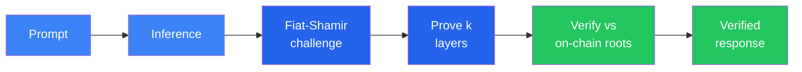

# What is Verathos?

**Verathos is a verified AI compute network on [Bittensor](https://bittensor.com) (Subnet 96).** Any tensor operation in any inference or training step can be cryptographically proven (via ZK-inspired **sumcheck-based verification** over Merkle-committed weights, anchored on-chain) and validators verify proofs on CPU in milliseconds. Any computer in the world can compete to serve or train models. The best are rewarded. The dishonest are caught. The entire process is transparent, verifiable, and permissionless.

## What We Verify

### Verified Inference: Live

A proof plugin integrates directly into production vLLM serving, as simple as it can get, as complex as necessary. It captures the minimal information needed during CUDA graph execution to generate cryptographic proofs without disrupting the serving pipeline. Miners serve models at full speed while **sumcheck proofs** are generated in parallel for k random layers per request. There is no challenge-response round trip: the challenge is derived deterministically during inference via Fiat-Shamir, bound to the output commitment. Overhead is minimal, single-digit percentages depending on concurrent batch load.



### Intelligent Routing: Next

The current gateway routes by throughput and model utility scores. The next step is content-aware routing: a learned classifier that selects the best model for each query based on complexity, domain, and task type. This works with the existing model pool and improves inference quality without requiring new hardware or models from miners. See [Active Research](research.md) for details.

### Verified Training: In Testing

The same proof system extends to training. The training prover verifies the forward pass, backward pass (gradient GEMM), and optimizer step. Supported methods include full fine-tuning and LoRA, with AdamW, SGD, and Muon optimizers. A training job produces proofs that the correct base model was fine-tuned with the claimed data and optimizer, not fabricated or substituted. Final adapter weights are hashed and delivered on-chain for reproducibility. The protocol is implemented and tested but not yet active on the network.

## What the Proof Guarantees

| Claim | How it's verified |
|-------|-------------------|
| **Correct model weights** | Merkle root of quantized weights stored on-chain. Proof checks layer outputs against committed weights. Wrong model = caught on any challenged layer. |
| **Correct computation** | Sumcheck protocol: prover and verifier agree on the GEMM result via an interactive protocol (made non-interactive with Fiat-Shamir). |
| **Output integrity** | SHA-256 commitment over full output, bound to the proof via Fiat-Shamir. Tampering invalidates the proof. |
| **Probabilistic coverage** | k random layers challenged per request. Substituting even 1 layer is caught with probability k/N per query, approaching 100% over multiple queries. |

### TEE Verification (complementary, not yet enabled on mainnet)

Verathos also supports hardware-based verification via Trusted Execution Environments (Intel TDX, AMD SEV-SNP, NVIDIA Confidential Computing). TEE attestation proves a miner is running unmodified code inside a hardware-isolated enclave, and enables end-to-end encryption so the miner operator cannot read user prompts. Code integrity is enforced via on-chain measurement allowlists (MRTD verification). TEE and cryptographic proofs are complementary: TEE adds privacy, cryptographic proofs keep the network permissionless and hardware-agnostic. Miners can run either or both. See [Inference Protocol: TEE Verification](inference_protocol.md#tee-verification-trusted-execution-environments) for details.

## Architecture

Verathos has three roles on the Bittensor network:

| Role | What it does |
|------|--------------|
| **Miner** | Serves models with cryptographic proofs for every inference step. Can register multiple model endpoints per hotkey on Bittensor EVM (no UID pressure, scores accumulate). |
| **Validator** | Tests miners with canary requests, verifies proofs. Scores inference on model utility (parameters, context length, quantization), throughput, and time-to-first-token. Proof failure = instant score zero. Sets weights on Bittensor. |
| **Gateway** | User-facing API gateway (OpenAI-compatible). Routes requests to miners weighted by score. Handles payments. |

On-chain smart contracts on Bittensor EVM handle model registration, miner endpoints, payment deposits, and validator discovery. See [Bittensor Integration](bittensor_integration.md) for architecture details and [Economic Model](economic_model.md) for contract mechanics.

## OpenAI-Compatible API

Drop-in replacement for any OpenAI SDK. Point your `base_url` at Verathos and every response is cryptographically verified.

```python
from openai import OpenAI

client = OpenAI(
    base_url="https://api.verathos.ai/v1",
    api_key="vrt_sk_YOUR_KEY",
)

response = client.chat.completions.create(
    model="auto",  # or a specific model like "qwen3-8b"
    messages=[{"role": "user", "content": "Hello!"}],
)
print(response.choices[0].message.content)
```

Every response includes `proof_verified: true` and verification timing. Set `model` to `"auto"` and the gateway picks the best available node across all models via score-weighted routing.

## Integrations

Works with any OpenAI-compatible client out of the box. For popular AI agent frameworks, dedicated plugins add model discovery, proof metadata, and x402 payment support:

| Framework | Plugin | What it adds |
|-----------|--------|-------------|
| **LiteLLM** | `litellm-verathos` | `verathos/` model prefix, also unlocks CrewAI, Letta, Swarms |
| **LangChain** | `langchain-verathos` | `ChatVerathos` with proof metadata in `response_metadata` |
| **elizaOS** | `@elizaos/plugin-verathos` | Full model provider with x402 + CDP wallet for autonomous agents |
| **OpenClaw** | `openclaw-verathos` | Provider plugin with model discovery |
| **Hermes Agent** | Config only | Just set `base_url` in config |
| **AutoGen** | Config only | `OpenAIChatCompletionClient(base_url=...)` |

See [Integrations](integrations.md) for setup instructions and code examples.

## Pricing & Payment

### Pricing (USD per 1M tokens)

| Tier | Input | Output | Example models |
|------|-------|--------|----------------|
| Small | $0.08 | $0.14 | Qwen3-8B, Qwen3.5-9B, Llama-3.1-8B |
| Medium | $0.20 | $0.35 | Qwen3-14B, Gemma-3-27B, GPT-oss-20B, Qwen3.5-35B-A3B |
| Large | $0.35 | $0.65 | Llama-3.3-70B, Qwen3.5-122B-A10B |
| XL | $0.50 | $1.20 | Qwen3-235B-A22B, DeepSeek-V3, GPT-oss-120B, MiniMax-M2.5, Kimi-K2 |

Every response is verified, and verification cost is included in the price.

### Payment methods

| Method | How it works |
|--------|-------------|
| **TAO deposit** | Deposit TAO to PaymentGateway. 100% buys subnet alpha (permanent buy pressure, higher emissions). Owner cut starts at 0%, configurable up to 20%. |
| **USDC deposit** | Deposit USDC on Base L2. Credited as USD balance. |
| **x402 (pay-per-request)** | HTTP 402 protocol: attach USDC payment to each request. No account needed. Built for autonomous agents. |

## Quick Links

- **[User Guide](user_guide.md)**: API keys, deposits, inference requests, withdrawals
- **[Setup Guide](setup.md)**: Run a miner or validator
- **[API Reference](api.md)**: Full HTTP API reference
- **[Bittensor Integration](bittensor_integration.md)**: Epoch testing, scoring, architecture
- **[Inference Protocol](inference_protocol.md)**: Deep dive into sumcheck-based verification
- **[Active Research](research.md)**: Intelligent routing, verified training, and long-term vision
- **[Economic Model](economic_model.md)**: Tokenomics, alpha staking, pricing details
