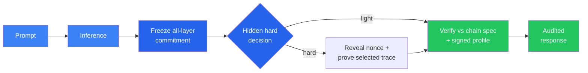

# What is Verathos?

**Verathos is an AI compute network on [Bittensor](https://bittensor.com)
(Subnet 96).** Gleipnir proof protocol v3 combines nonce-free light response
commitments with unpredictable hard execution audits. Validators check signed
model profiles and selected execution relations on CPU without loading model
weights.

## What We Verify

### Probabilistic verified inference: Gleipnir v3

A graph-integrated capture plugin prepares authenticated execution roots without
delaying token streaming. Every ordinary response is bound to a light
commitment. On an unpredictable canary, the validator reveals its nonce only
after that commitment is frozen and the miner proves the derived execution
relations.


```mermaid
flowchart LR
    A["Prompt"] --> B["Inference"]
    B --> C["Freeze all-layer\ncommitment"]
    C --> D{"Hidden hard\ndecision"}
    D -->|light| E["Validate request/output\ncommitment"]
    D -->|hard| G["Reveal nonce +\nprove selected trace"]
    G --> E["Verify vs chain spec\n+ signed profile"]
    E --> F["Audited\nresponse"]

    style A fill:#3b82f6,color:#fff
    style B fill:#3b82f6,color:#fff
    style C fill:#2563eb,color:#fff
    style D fill:#2563eb,color:#fff
    style E fill:#22c55e,color:#fff
    style F fill:#22c55e,color:#fff
```

### Intelligent Routing: Next

The current gateway routes by throughput and model utility scores. The next step is content-aware routing: a learned classifier that selects the best model for each query based on complexity, domain, and task type. This works with the existing model pool and improves inference quality without requiring new hardware or models from miners. See [Active Research](research.md) for details.

### Verified Training: In Testing

The same proof system extends to training. The training prover verifies the forward pass, backward pass (gradient GEMM), and optimizer step. Supported methods include full fine-tuning and LoRA, with AdamW, SGD, and Muon optimizers. A training job produces proofs that the correct base model was fine-tuned with the claimed data and optimizer, not fabricated or substituted. Final adapter weights are hashed and delivered on-chain for reproducibility. The protocol is implemented and tested but not yet active on the network.

## What the Proof Guarantees

| Claim | How it's verified |
|-------|-------------------|
| **Light response binding** | The prompt, sampler, observed output and frozen runtime roots are bound to one canonical v3 envelope. |
| **Authenticated selected weights** | Hard openings bind selected operations to authority-signed artifacts matching the live on-chain ModelSpec. |
| **Sound selected computation** | The compact-v9 hard proof verifies the nonce-selected registered relations and connected terminal path. |
| **Probabilistic coverage** | Secret-seeded hard canaries sample execution under a signed policy; hot-capacity auditing supplies a complementary resource check. |

Gleipnir is not a full transformer SNARK. A light response is a commitment
success, not a hard execution proof. Hard proofs open selected registered
relations rather than every operation. The production claim is probabilistic
economic integrity across repeated hidden audits, not deterministic proof of
every operation on every request.

### TEE Verification (complementary, not yet enabled on mainnet)

Verathos also supports hardware-based verification via Trusted Execution Environments (Intel TDX, AMD SEV-SNP, NVIDIA Confidential Computing). TEE attestation proves a miner is running approved code inside a hardware-isolated enclave and can enable end-to-end encrypted prompts. See the [User Guide](user_guide.md#tee-inference-trusted-execution-environments) for details.

## Architecture

Verathos has three roles on the Bittensor network:

| Role | What it does |
|------|--------------|
| **Miner** | Serves models with probabilistic cryptographic audits. Can register multiple model endpoints per hotkey on Bittensor EVM (no UID pressure, scores accumulate). |
| **Validator** | Tests miners with canary requests and verifies proofs. Scores inference on model utility (parameters, context length, quantization), throughput, and time-to-first-token. Outside maintenance suppression, proof failure follows the configured failure/probation path. Sets weights on Bittensor. |
| **Gateway** | User-facing API gateway (OpenAI-compatible). Routes requests to miners weighted by score. Handles payments. |

On-chain smart contracts on Bittensor EVM handle model registration, miner endpoints, payment deposits, and validator discovery. See [Bittensor Integration](bittensor_integration.md) for architecture details and [Economic Model](economic_model.md) for contract mechanics.

## OpenAI-Compatible API

Drop-in replacement for any OpenAI SDK. Point your `base_url` at Verathos;
ordinary responses use the normal OpenAI shape and expose protocol metadata
when requested.

```python
from openai import OpenAI

client = OpenAI(
    base_url="https://api.verathos.ai/v1",
    api_key="vrt_sk_YOUR_KEY",
)

response = client.chat.completions.create(
    model="auto",  # or a specific model like "qwen3-8b"
    messages=[{"role": "user", "content": "Hello!"}],
)
print(response.choices[0].message.content)
```

Ordinary v3 responses report an accepted light proof rather than fabricating
a hard-audit verdict. A legacy v1 compatibility response remains v1, and a
maintenance-suppressed failure remains a recorded failure. Set `model` to
`"auto"` and the gateway picks an eligible node using score-weighted routing.

## Integrations

Works with any OpenAI-compatible client out of the box. For popular AI agent frameworks, dedicated plugins add model discovery, proof metadata, and x402 payment support:

| Framework | Plugin | What it adds |
|-----------|--------|-------------|
| **LiteLLM** | `litellm-verathos` | `verathos/` model prefix, also unlocks CrewAI, Letta, Swarms |
| **LangChain** | `langchain-verathos` | `ChatVerathos` with proof metadata in `response_metadata` |
| **elizaOS** | `@elizaos/plugin-verathos` | Full model provider with x402 + CDP wallet for autonomous agents |
| **OpenClaw** | `openclaw-verathos` | Provider plugin with model discovery |
| **Hermes Agent** | Config only | Just set `base_url` in config |
| **AutoGen** | Config only | `OpenAIChatCompletionClient(base_url=...)` |

See [Integrations](integrations.md) for setup instructions and code examples.

## Pricing & Payment

### Pricing (USD per 1M tokens)

| Tier | Input | Output | Example models |
|------|-------|--------|----------------|
| Small | $0.08 | $0.14 | Qwen3-8B, Qwen3.5-9B, Llama-3.1-8B |
| Medium | $0.20 | $0.35 | Qwen3-14B, Gemma-3-27B, GPT-oss-20B, Qwen3.5-35B-A3B |
| Large | $0.35 | $0.65 | Llama-3.3-70B, Qwen3.5-122B-A10B |
| XL | $0.50 | $1.20 | Qwen3-235B-A22B, DeepSeek-V3, GPT-oss-120B, MiniMax-M2.5, Kimi-K2 |

Proof-bound responses carry their verification status, and verification cost is
included in the price. During a configured maintenance window, a response may
be explicitly unverified; maintenance does not turn it into a valid proof.

### Payment methods

| Method | How it works |
|--------|-------------|
| **TAO prepaid credit** | Send native TAO from the linked SS58 wallet to the service's fixed receiver. Credited in USD after finalized verification using a fresh market price. |
| **USDC prepaid credit** | Authorize an x402 Permit2 payment from the linked EVM wallet. Credited 1:1 after facilitator settlement. |
| **x402 (pay-per-request)** | HTTP 402 protocol: attach USDC payment to each request. No account needed. Built for autonomous agents. |

## Quick Links

- **[User Guide](user_guide.md)**: wallet accounts, billing, conviction, API keys, and inference
- **[Setup Guide](setup.md)**: Run a miner or validator
- **[API Reference](api.md)**: Full HTTP API reference
- **[Bittensor Integration](bittensor_integration.md)**: Epoch testing, scoring, architecture
- **[Inference Protocol](inference_protocol.md)**: Light proofs and unpredictable hard audits
- **[Active Research](research.md)**: Intelligent routing, verified training, and long-term vision
- **[Economic Model](economic_model.md)**: Tokenomics, alpha staking, pricing details
